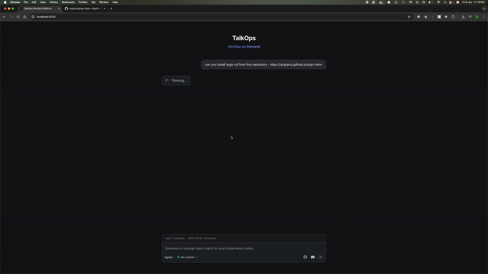

# k8s-autopilot

> **Multi-Agent Framework for Kubernetes Automation (Generation & Management)**

[](https://discord.gg/hFt5DAYEVx) [](https://hub.docker.com/r/sandeep2014/k8s-autopilot) [](LICENSE) [](https://www.python.org/) [](https://github.com/langchain-ai/langgraph) [](https://github.com/google/a2a)

**k8s-autopilot** is an intelligent, multi-agent framework that automates the complete lifecycle of Kubernetes operations. Built on LangChain and LangGraph, it acts as a unified platform for both **Helm Chart Generation** (transforming natural language requirements into production-ready charts) and **Active Cluster Management** (installing, upgrading, and maintaining releases with Human-in-the-loop safety).

---

## 🎬 Demo

See k8s-autopilot in action! Watch how it generates production-ready Helm charts and manages cluster deployments through natural language conversations:

[](demo/autopilot_demo.mp4)

*Click the thumbnail above to download and watch the full demo video*

> **💡 Quick Overview**: The demo showcases installing ArgoCD from a public Helm repository through natural language. Watch the agent discover the chart, plan the installation, and deploy to a Kubernetes cluster with interactive UI components and Human-in-the-Loop approval gates.

---

## 🎯 What It Does

k8s-autopilot automates the end-to-end lifecycle of Kubernetes operations, from initial design to active cluster management:

1. **📋 Planning**: Analyzes requirements, validates completeness, and designs Kubernetes architecture
2. **⚙️ Generation**: Generates Helm templates, values files, and documentation
3. **✅ Validation**: Validates charts, performs security scanning, and ensures production readiness
4. **� Management**: Installs, upgrades, and rolls back releases on active clusters via a dual-path agent
5. **�🔄 Self-Healing**: Automatically fixes common errors (YAML indentation, deprecated APIs, missing fields)
6. **👤 Human-in-the-Loop**: Requests approvals at critical workflow points (Plan, Template, Execution)

### Current Capabilities

**✅ Fully Supported**:
- Helm chart planning and architecture design
- Helm chart template generation (Deployment, Service, Ingress, ConfigMap, Secret, HPA, PDB, NetworkPolicy, etc.)
- Traefik IngressRoute generation (modern CRD-based routing)
- Helm chart validation (lint, template rendering, cluster compatibility)
- Self-healing validation errors
- Self-healing validation errors
- Human-in-the-loop approvals
- **Active Helm Management**: Install, Upgrade, Rollback, Uninstall charts
- **Cluster Discovery**: Inspect releases and cluster state

**🚧 Planned** (Future Releases):
- Automated deployment to Kubernetes clusters
- CI/CD pipeline generation
- Sidecar and initcontainer YAML generation in Helm chart templates (currently: analysis/planning only)
- Prometheus ServiceMonitor/PodMonitor resource generation (currently: monitoring labels/annotations only)

---

## 🏗️ Architecture

k8s-autopilot follows a **hierarchical supervisor-with-swarms** pattern, leveraging LangChain's Deep Agents and LangGraph for orchestration.

### High-Level Architecture

```
┌─────────────────────────────────────────────────────────────────┐
│                    Supervisor Agent                              │
│  - Orchestrates workflow phases                                  │
│  - Manages HITL approvals                                        │
│  - Coordinates agent swarms                                      │
│  - Handles state transformation                                  │
└──────────────┬───────────────────────────────────────────────────┘
               │
    ┌──────────┴──────────┬──────────────┬──────────────────────┐
    │                     │              │                      │
    ▼                     ▼              ▼                      ▼
┌─────────────┐    ┌──────────────┐  ┌──────────────┐   ┌─────────────┐
│  Planner    │    │  Template    │  │  Generator   │   │  HITL       │
│  Agent      │───▶│  Coordinator │──▶│  Agent       │   │  Gates      │
│             │    │              │  │              │   │             │
│ (Deep       │    │ (LangGraph   │  │ (Deep        │   │ (Interrupt  │
│  Agent)     │    │  StateGraph) │  │  Agent)      │   │  Tools)     │
└─────────────┘    └──────────────┘  └──────────────┘   └─────────────┘
       ▲
       │ (Generative Flow)
       │
┌─────────────┐
│  Helm Mgmt  │ (Operational Flow)
│  Agent      │◀───────────────────
│ (Deep Agent)│
└─────────────┘
```

### Architecture Components

#### 1. **Supervisor Agent**
Central orchestrator that coordinates workflow phases and manages state flow between swarms.

**Key Features**:
- Tool-based delegation pattern (`create_agent()`)
- State transformation between supervisor and swarm schemas
- HITL gate management
- Stream processing with interrupt detection

📖 **[Supervisor Agent Documentation](./docs/helm_generation/supervisor/README.md)**

#### 2. **Planner Agent**
Deep agent that analyzes requirements and designs Kubernetes architecture.

**Key Features**:
- Requirement extraction from natural language
- Gap detection and HITL clarification requests
- Architecture planning following Bitnami standards
- Resource estimation and scaling strategy

📖 **[Planner Agent Documentation](./docs/helm_generation/planner/planner-agent-documentation.md)**

#### 3. **Template Coordinator Agent**
LangGraph-based coordinator that generates Helm chart templates and values files.

**Key Features**:
- 13 specialized generation tools
- Dependency-aware execution
- Phase-based workflow (core → conditional → documentation)
- Traefik IngressRoute generation

📖 **[Template Coordinator Documentation](./docs/helm_generation/template/README.md)**

#### 4. **Generator Agent (Validator)**
Deep agent that validates, self-heals, and ensures charts are production-ready.

**Key Features**:
- Helm validation (lint, template, dry-run)
- Autonomous error fixing
- Retry logic with human escalation
- Workspace file management

📖 **[Generator Agent Documentation](./docs/helm_generation/generator/README.md)**

#### 5. **Helm Management Deep Agent**
Specialized operational agent for managing Helm releases on active clusters.

**Key Features**:
- **Dual-Path Architecture**: Query Path (Fast) vs Workflow Path (Safe)
- **5-Phase Workflow**: Discovery → Confirmation → Planning → Approval → Execution
- **Context Awareness**: Upgrade detection and diffing
- **Safety**: Strict HITL gates for all state-changing operations

**Dependencies**:
- **Helm MCP Server**: The Helm Management agent requires the [Helm MCP Server](./docs/mcp/helm-mcp-server.md) to be running and configured. The MCP server provides the underlying tools and resources for Helm operations (chart discovery, installation, validation, monitoring, etc.).

📖 **[Helm Management Documentation](./docs/helm_mgmt/README.md)** | 📖 **[Helm MCP Server Documentation](./docs/mcp/helm-mcp-server.md)**

---

## 🚀 Quick Start

### Prerequisites

- Python 3.12+
- Helm CLI installed and in PATH (required for local usage; not needed if running via Docker image)
- LLM API key (OpenAI, Anthropic)
- TalkOps client installed: `pip install talkops-client` (or `uv pip install talkops-client` if using uv)

### Installation

#### Option 1: Docker Hub (Recommended for Quick Start)

**Pull and run the pre-built image from Docker Hub:**

```bash
# Pull the latest version
docker pull sandeep2014/k8s-autopilot:latest

# Run the A2A server
docker run -d -p 10102:10102 \
  -e OPENAI_API_KEY=your_openai_key_here \
  --name k8s-autopilot \
  sandeep2014/k8s-autopilot:latest
```

> **Note:** It's recommended to mount a local volume to persist generated Helm charts. By default, the agent writes charts to `/tmp/helm-charts` inside the container. You can mount a local directory and optionally configure the agent to write to a different directory:
>
> ```bash
> docker run -d -p 10102:10102 \
>   -e OPENAI_API_KEY=your_openai_key_here \
>   -v /path/to/local/charts:/tmp/helm-charts \
>   --name k8s-autopilot \
>   sandeep2014/k8s-autopilot:latest
> ```
>
> This allows you to access the generated Helm charts from your host machine and use them to install applications on your Kubernetes cluster.

**Available Docker tags:**

- `latest` - Latest stable release
- `v0.2.0` - Specific version

#### Option 2: Standalone Installation

1. **Install [uv](https://docs.astral.sh/uv/getting-started/installation/)** for dependency management

2. **Create and activate a virtual environment with Python 3.12:**

   ```sh
   uv venv --python=3.12
   source .venv/bin/activate  # On Unix/macOS
   # or
   .venv\Scripts\activate  # On Windows
   ```

3. **Install dependencies from pyproject.toml:**

   ```sh
   uv pip install -e .
   ```

4. **Create a `.env` file and add the following environment variables:**

   ```sh
   OPENAI_API_KEY=XXXXXXXXX
   ```

   > **Note:** All available configuration options can be found in [`k8s_autopilot/config/default.py`](k8s_autopilot/config/default.py). You can set any of these options via your `.env` file to customize the k8s-autopilot agent's behavior.

5. **Start the A2A server with the agent card:**

   ```sh
   uv run --active k8s-autopilot \
     --host localhost \
     --port 10102 \
     --agent-card k8s_autopilot/card/k8s_autopilot.json
   ```

### Working with Agents

The easiest way to interact with k8s-autopilot is using the **TalkOps Web UI** via Docker Compose, which sets up the complete stack including the k8s-autopilot agent, Helm MCP Server, and TalkOps Web UI.

1. **Create a `.env` file** in the project root with your LLM provider API key:

   ```bash
   # Required: LLM Provider API Key
   OPENAI_API_KEY=your_openai_api_key_here
   
   # Optional: Customize LLM models (defaults shown below)
   # LLM_PROVIDER=openai
   # LLM_MODEL=gpt-4o-mini
   # LLM_HIGHER_MODEL=gpt-4o
   # LLM_DEEPAGENT_MODEL=o1-mini
   ```

   > **Note:** For other LLM providers (Anthropic, Google Gemini, Azure, etc.), see the [LLM Provider Configuration Guide](docs/ONBOARDING_LLM_PROVIDER.md) for detailed setup instructions and supported models.

2. **Start the services** using Docker Compose:

   ```bash
   docker-compose up -d
   ```

   This will start three services:
   - **k8s-autopilot**: The main agent (port 10102)
   - **helm-mcp-server**: Helm operations backend (port 9000)
   - **talkops-ui**: Web interface (port 8080)

3. **Access the Web UI** by opening your browser to:

   ```
   http://localhost:8080
   ```

4. **Start chatting** with the agent to create Helm charts, manage releases, or query your cluster:

   ```
   Create a Helm chart for nginx
   ```

   or

   ```
   List all Helm releases in my cluster
   ```

   or

   ```
   Install argo-cd helm chart from this repository - https://argoproj.github.io/argo-helm
   ```

   The agent will guide you through the process, asking for clarifications if needed, and generate production-ready Helm charts or perform cluster operations via MCP server.

5. **Access generated charts**: Charts are saved to `./helm_output` directory on your host machine.

---

## 🔄 Workflows

k8s-autopilot supports two primary workflows: **Helm Chart Generation** (creating new charts from scratch) and **Helm Management** (managing releases on active clusters).

### Workflow 1: Helm Chart Generation

For creating production-ready Helm charts from natural language requirements:

```
User Request: "Create a Helm chart for nginx"
    ↓
1. Supervisor → Planner Agent
   - Extracts requirements
   - Detects gaps (if any) → HITL clarification
   - Designs architecture
   - Creates chart plan
    ↓
2. Supervisor → Template Coordinator
   - Generates Chart.yaml
   - Generates values.yaml
   - Generates templates (Deployment, Service, IngressRoute, etc.)
   - Generates README.md
    ↓
3. Supervisor → HITL Gate (Generation Review)
   - Shows generated artifacts
   - Requests workspace directory
   - Human approval required
    ↓
4. Supervisor → Generator Agent (Validator)
   - Writes chart files to workspace
   - Runs helm lint validation
   - Runs helm template validation
   - Runs helm dry-run validation
   - Self-heals errors (if possible)
   - Escalates to human (if needed)
    ↓
5. Supervisor → Final Notification
   - Workflow complete
   - Deployment instructions provided
```

### Workflow 2: Helm Management (via MCP Server)

For managing Helm releases on active Kubernetes clusters:

```
User Request: "Install argo-cd from https://argoproj.github.io/argo-helm"
    ↓
1. Supervisor → Helm Management Agent (Discovery Phase)
   - Connects to Helm MCP Server
   - Searches for chart in repository
   - Retrieves chart metadata, README, and values schema
   - Analyzes cluster context (existing releases, namespaces)
    ↓
2. Helm Management Agent → HITL Gate (Confirmation)
   - Presents chart information and options
   - Requests user confirmation for installation
   - Collects custom values (if needed)
    ↓
3. Helm Management Agent → Planning Phase
   - Generates installation plan via MCP server
   - Validates values against schema
   - Renders manifests for preview
   - Checks dependencies and prerequisites
    ↓
4. Helm Management Agent → HITL Gate (Approval)
   - Shows installation plan and resource estimates
   - Displays rendered manifests
   - Requests final approval before execution
    ↓
5. Helm Management Agent → Execution Phase
   - Executes helm install via MCP server
   - Monitors deployment health
   - Reports status and next steps
    ↓
6. Supervisor → Final Notification
   - Installation complete
   - Release status and access instructions provided
```

**Key Differences**:
- **Generation Workflow**: Creates new Helm charts from scratch, outputs to local filesystem
- **Management Workflow**: Uses Helm MCP Server to interact with live clusters, performs actual deployments
- **Both workflows**: Include multiple HITL gates for safety and human oversight

**Supported Operations** (Management Workflow):
- 🔍 **Query**: List releases, get release status, inspect cluster state
- 📦 **Install**: Deploy new Helm releases with validation
- ⬆️ **Upgrade**: Update existing releases with diff preview
- ⏮️ **Rollback**: Revert to previous revisions
- 🗑️ **Uninstall**: Remove releases from cluster

### Human-in-the-Loop Gates

**Mandatory Gates**:
- **Generation Review**: After template generation completes
  - Review generated artifacts
  - Specify workspace directory
  - Approval required before validation

**Optional Gates**:
- **Planning Review**: Currently auto-proceeds (can be enabled)
- **Validation Escalation**: When validator cannot auto-fix errors

---

## 🛠️ Technology Stack

### Core Framework

- **LangChain v1.0**: LLM integration and tool framework
- **LangGraph v1.0**: Stateful graph orchestration
- **Deep Agents**: Multi-step reasoning and autonomous problem-solving
- **Pydantic v2**: Type-safe state schemas and validation

### Kubernetes & Helm

- **Helm CLI**: Chart validation and template rendering
- **Traefik CRDs**: Modern ingress routing

### State Management

- **PostgreSQL Checkpointer**: Persistent state storage (preferred)
- **MemorySaver**: In-memory checkpointing (fallback)
- **State Reducers**: Concurrent update handling

### User Interface & Integration

- **A2UI (Agent-to-Agent UI)**: Rich interactive UI components (cards, buttons, forms) for enhanced user experience
- **A2A Protocol**: Google's Agent-to-Agent communication protocol for enterprise agent ecosystems
- **Programmatic UI Builders**: Type-safe UI generation without LLM hallucination
- **Interactive HITL Gates**: Button-based approvals and structured input forms

## LLM Providers

k8s-autopilot supports a wide range of LLM providers including OpenAI, Anthropic, Google Gemini, Azure, and AWS Bedrock. The framework is designed to be provider-agnostic, allowing you to choose the best models for your specific requirements and budget.

### LLM Configuration

#### Multi-Provider Architecture

The system utilizes a provider-agnostic abstraction layer to support various LLM backends:

- **Multi-Provider Support**: Unified interface for 12+ LLM providers (OpenAI, Anthropic, Azure, Google Gemini, AWS Bedrock, etc.)
- **Model Selection**: Configurable model selection per agent via config
- **Parameter Tuning**: Adjustable temperature, max tokens, and other parameters
- **Provider Switching**: Easy switching between different LLM providers via configuration
- **Auto-Inference**: Automatic provider detection from model names

#### Configuration

LLM providers are configured via environment variables. The system supports a **Multi-Model Strategy**, allowing you to optimize for cost and performance by using different models for different roles.

**Basic Configuration (.env):**
```bash
LLM_PROVIDER="openai"
LLM_MODEL="gpt-4o"
OPENAI_API_KEY="sk-..."
```

**Advanced / Hybrid Configuration:**
You can mix providers to use high-reasoning models (like `o1-mini` or `claude-3-opus`) for the Supervisor and faster/cheaper models (like `gemini-1.5-flash` or `gpt-4o-mini`) for Sub-Agents.

```bash
# Supervisor (High Reasoning)
LLM_DEEPAGENT_PROVIDER="openai"
LLM_DEEPAGENT_MODEL="o1-mini"

# Sub-Agents (High Speed/Low Cost)
LLM_PROVIDER="google_genai"
LLM_MODEL="gemini-1.5-flash"
```

For detailed configuration instructions, supported status, and API key setup for all 12+ providers (OpenAI, Anthropic, Gemini, Azure, Bedrock, etc.), please refer to the **[Onboarding Guide: Configuring LLM Providers](docs/ONBOARDING_LLM_PROVIDER.md)**.

#### Supported Providers

- **OpenAI**: `gpt-4o`, `gpt-4-turbo`, `gpt-3.5-turbo`
- **Anthropic**: `claude-3-opus-20240229`, `claude-3-sonnet-20240229`
- **Azure OpenAI**: `azure_openai:model-name`
- **Google Gemini**: `google_genai:gemini-2.5-flash-lite`
- **AWS Bedrock**: Various models via `bedrock_converse` provider

---

## 📋 Roadmap

### Past Releases (v0.1.0)

**✅ Implemented**:
- [x] Multi-agent architecture with supervisor pattern
- [x] Planning agent with requirement extraction
- [x] Template coordinator with 13 generation tools
- [x] Generator agent with validation and self-healing
- [x] HITL gates for approval workflows
- [x] State transformation and persistence
- [x] Traefik IngressRoute support
- [x] **Helm Management Agent**: Live cluster operations
- [x] Comprehensive documentation

### Current Release (v0.2.0)

**✅ Implemented**:
- [x] **Helm Management Agent**: Full lifecycle management (Install, Upgrade, Rollback) with active cluster state awareness
- [x] **Multi-LLM Model Support**: Provider-agnostic architecture supporting a mix of models (OpenAI, Anthropic, Gemini, Bedrock) optimized for cost and performance
- [x] **A2UI & A2A Protocol**: Seamless integration with Google's Agent-to-Agent (A2A) protocol and rich UI components via A2UI


### Future Releases

**v0.3.0 - Enhanced Validation** (Planned):
- [ ] Policy compliance checking
- [ ] Helm unit test generation
- [ ] ArgoCD Application Onboarding
- [ ] Traefik IngressRoute improvements and enhanced features

**v0.3.0 - Deployment Automation** (Planned):
- [ ] Automated deployment to Kubernetes clusters
- [ ] Deployment rollback capabilities
- [ ] Multi-cluster deployment strategies
- [ ] Deployment status monitoring

**v0.4.0 - CI/CD Integration** (Planned):
- [ ] GitHub Actions workflow generation
- [ ] GitLab CI pipeline generation
- [ ] Jenkins pipeline generation

**v0.5.0 - Testing & Evaluation** (Planned):
- [ ] Test case generation for Helm charts
- [ ] Evaluation framework integration
- [ ] Automated testing integration
- [ ] Chart quality metrics and scoring

**v0.6.0 - Extended Capabilities** (Planned):
- [ ] Application monitoring setup (Prometheus, Grafana)
- [ ] Logging aggregation (ELK, Loki)
- [ ] Service mesh integration (Istio, Linkerd)
- [ ] Multi-cloud deployment support

---

## 🏛️ Architecture Principles

### 1. **Modular Swarm Design**
Each agent swarm is independently deployable and scalable, allowing for:
- Independent updates and versioning
- Horizontal scaling of individual swarms
- Easy addition of new capabilities

### 2. **Stateful Orchestration**
LangGraph provides:
- Explicit state management with reducers
- Checkpointing for resumable workflows
- Interrupt handling for HITL interactions

### 3. **Tool-Based Delegation**
Supervisor uses tool wrappers instead of manual routing:
- LLM decides routing dynamically
- Simplified graph building
- Easy to add new swarms

### 4. **Human-Centric Design**
HITL gates ensure:
- Human oversight at critical points
- Approval workflows for production readiness
- Escalation when autonomous fixes fail

### 5. **Self-Healing Capabilities**
Agents autonomously fix common errors:
- YAML indentation issues
- Deprecated API versions
- Missing required fields
- Retry logic with human escalation


---

## 🤝 Contributing

We welcome contributions! Please see below details.

### Development Setup

```bash
# Clone repository
git clone https://github.com/talkops-ai/k8s-autopilot.git
cd k8s-autopilot

# Install uv (if not already installed)
# See: https://docs.astral.sh/uv/getting-started/installation/

# Create virtual environment with Python 3.12
uv venv --python=3.12
source .venv/bin/activate  # On Windows: .venv\Scripts\activate

# Install development dependencies
uv pip install -e .

```

### Development Workflow

1. **Fork the repository**
2. **Create a feature branch** (`git checkout -b feature/amazing-feature`)
3. **Commit your changes** (`git commit -m 'Add amazing feature'`)
4. **Push to the branch** (`git push origin feature/amazing-feature`)
5. **Open a Pull Request**

### Contributing Guidelines

- Follow the existing code style and conventions
- Add tests for new features
- Update documentation as needed
- Ensure all tests pass before submitting PR
- Write clear, descriptive commit messages

### Code Style

- **Formatting**: Black
- **Linting**: Ruff
- **Type Checking**: mypy
- **Documentation**: Google-style docstrings

---

## 📝 License

This project is licensed under the Apache License 2.0 - see the [LICENSE](LICENSE) file for details.

---

## 🙏 Acknowledgments

- **LangChain Team**: For the excellent LangChain and LangGraph frameworks
- **Google A2A Protocol**: For the Agent-to-Agent communication protocol enabling enterprise agent ecosystems
- **CNCF**: For Kubernetes and Helm community standards
- **Traefik**: For modern ingress routing capabilities

---

## 💬 Community & Support

Join our community to get help, share ideas, and contribute to the project!

### Discord Community

**Join our Discord**

Connect with other users, developers, and contributors:

- 💡 **Get Help**: Ask questions and get support from the community
- 🚀 **Share Projects**: Showcase your Helm charts and use cases
- 🐛 **Report Issues**: Discuss bugs and feature requests
- 🤝 **Collaborate**: Find contributors and collaborate on improvements
- 📢 **Stay Updated**: Get notified about new releases and updates

[Join the Discord Server →](https://discord.gg/hFt5DAYEVx)

### Getting Support

- **Discord**: For real-time help and discussions, join our Discord community
- **GitHub Issues**: For bug reports and feature requests, use [GitHub Issues](https://github.com/talkops-ai/k8s-autopilot/issues)
- **Documentation**: Check our comprehensive [documentation](./docs/) for guides and references

---

## 🌟 Star Us

If you find k8s-autopilot helpful, please consider starring our repository:

⭐ [https://github.com/talkops-ai/k8s-autopilot](https://github.com/talkops-ai/k8s-autopilot)


---

**Built with ❤️ for the DevOps and Infrastructure community**
