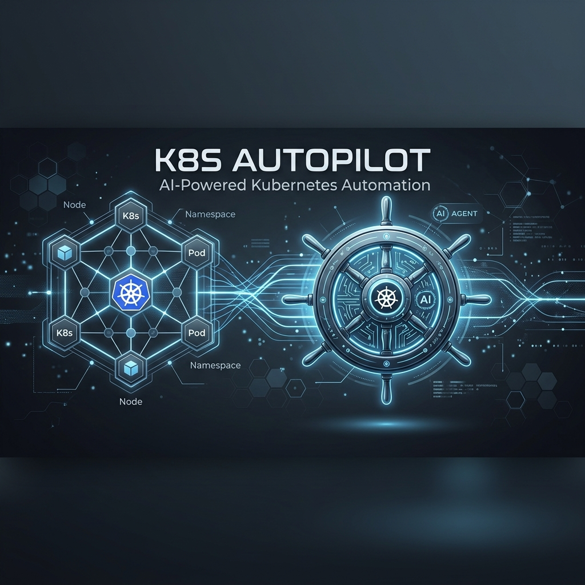
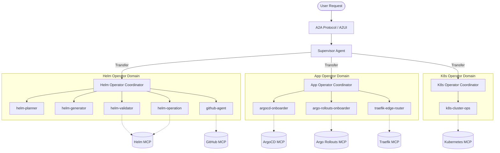

<p align="center">
  
</p>

# k8s-autopilot
**A stateful, multi-agent AI system that orchestrates Kubernetes deployments, manages progressive GitOps delivery, and safely debugs your cluster through conversation.**

[](https://opensource.org/licenses/Apache-2.0)
[](https://www.python.org/downloads/)
[](https://github.com/langchain-ai/langgraph)
[](https://discord.gg/3nz5MQAA7)
[](https://hub.docker.com/)

[**Quick Start**](#getting-started) •
[**Workflows**](#what-can-it-actually-do) •
[**Architecture**](#architecture) •
[**Report Bug**](#contact)

---

## ⚡ Quick Overview

See **k8s-autopilot** in action generating a Helm chart, validating it against best practices, and initiating a GitHub push via HITL approval:


> *The Helm Operator Coordinator automatically generating a chart, validating it with the Helm MCP server, and pausing for human approval before committing to GitHub.*

---

## ❓ Why k8s-autopilot?

### The Real Problem
If you've spent hours debugging a `CrashLoopBackOff`, trying to figure out why an ArgoCD sync is stuck, or carefully orchestrating a zero-downtime canary rollout, you know the pain of Kubernetes sprawl. It’s not just about writing YAML—it’s about the massive cognitive load of context-switching between `kubectl`, Argo dashboards, Helm releases, and Prometheus metrics just to safely ship or rollback code.

### Our Solution
**k8s-autopilot** is built to give you those hours back. We didn't just build a chatbot that generates YAML; we built a stateful, multi-agent AI system powered by the `deepagents` LangGraph framework that actually *understands* your cluster's context.

You simply talk to the **Supervisor Agent**. Need to migrate a legacy deployment to an Argo Rollouts blue-green deployment with zero downtime? The Supervisor hands it off to the **App Operator**, which actively reads your cluster state, generates the `workloadRef` configurations, sets up Prometheus `AnalysisTemplates` for safety, and waits for your explicit Human-in-the-Loop (HITL) approval before touching a single resource. 

---

## 🚀 What can it actually do?

k8s-autopilot natively supports dozens of complex, multi-step workflows across four major domains. It uses specialized "Skills" to execute these operations safely.

### ☸️ Kubernetes Operations (K8s Operator)
- **Automated Root Cause Analysis:** Ask the agent to "debug my failing pod" and it will automatically pull exit codes, scan previous container logs, check cluster events, and propose a fix for `CrashLoopBackOff` or `ImagePullBackOff`.
- **Resource Pressure Investigation:** Deeply investigate `OOMKilled` containers by correlating pod memory limits with live `nodes_top` and `pods_top` stats.
- **Safe Exec & Ephemeral Debugging:** Spin up temporary debug pods (like `netshoot` or `busybox`) to test DNS and connectivity, or safely exec into running containers.
- **Multi-Cluster Context Switching:** Natively list multi-cluster targets and seamlessly switch kubeconfig contexts for cross-cluster operations.
- **RBAC & Security Inspection:** Audit who has access by querying Roles, RoleBindings, and ServiceAccounts.

### ⛴️ Progressive Delivery (App Operator — Argo Rollouts)
- **Zero-Downtime Migrations:** Seamlessly convert standard K8s Deployments to Argo Rollouts using `workloadRef` without duplicating pods, dropping traffic, or causing ArgoCD GitOps drift.
- **Canary & Blue-Green Orchestration:** Execute step-based canary traffic shifting or instant blue-green cutovers.
- **Automated Rollbacks via Prometheus:** The agent configures `AnalysisTemplates` to automatically monitor error rates and P99 latency during a rollout, aborting instantly if thresholds are breached.
- **A/B Testing Experiments:** Spin up ephemeral baseline vs. candidate pods to shadow-test new images against live production traffic before committing.
- **Emergency Aborts:** Instantly revert traffic back to the stable ReplicaSet during a degraded rollout with a single command.

### 🔄 GitOps & Edge Routing (App Operator — ArgoCD & Traefik)
- **Declarative Onboarding:** Add new GitHub repositories and automatically provision isolated ArgoCD `AppProject` YAML manifests.
- **Automated Sync Debugging:** If an app is `OutOfSync` or `Degraded`, the agent analyzes the ArgoCD sync events and provides actionable remediation.
- **Traefik Edge Routing:** Set up weighted canary routes, TCP routing (Postgres/Redis), and traffic mirroring (shadow launches) at the edge.
- **Resiliency Middlewares:** Automatically attach rate limits, circuit breakers, TLS termination, and IP allowlists to your Traefik routes.
- **NGINX to Traefik Migration:** Automatically translate legacy NGINX Ingress annotations into native Traefik middleware and IngressRoute configurations.

### 📦 Helm Lifecycle (Helm Operator)
- **Intelligent Generation:** The agent reads the official chart `README` and `values.schema.json` to determine exactly which values are mandatory for your specific environment, prompting you only for what matters.
- **Live Upgrades & Rollbacks:** Modify active releases using `--reuse-values` or rollback to specific known-good revisions using the persistent operations journal.
- **GitHub Persistence:** Once a chart is generated and approved via HITL, the `github-agent` uses the GitHub MCP to commit the structured chart directly to your repository—no manual copy-pasting required.

---

## 🏗 Architecture

k8s-autopilot leverages the production-grade **Deep Agent** pattern, operating a multi-tier hierarchy of agents, MCP servers, and HITL gates.


```mermaid
graph TD
    User([User Request]) --> A2A[A2A Protocol / A2UI]
    A2A --> Sup[Supervisor Agent]
    
    Sup -- "Transfer" --> HelmCoord[Helm Operator Coordinator]
    Sup -- "Transfer" --> AppCoord[App Operator Coordinator]
    Sup -- "Transfer" --> K8sCoord[K8s Operator Coordinator]
    
    subgraph "Helm Operator Domain"
        HelmCoord --> HPlanner[helm-planner]
        HelmCoord --> HGen[helm-generator]
        HelmCoord --> HVal[helm-validator]
        HelmCoord --> HOp[helm-operation]
        HelmCoord --> GitHub[github-agent]
    end
    
    subgraph "App Operator Domain"
        AppCoord --> ArgoCD[argocd-onboarder]
        AppCoord --> ArgoR[argo-rollouts-onboarder]
        AppCoord --> Traefik[traefik-edge-router]
    end
    
    subgraph "K8s Operator Domain"
        K8sCoord --> K8sOp[k8s-cluster-ops]
    end
    
    HVal -.-> HMCP[(Helm MCP)]
    HOp -.-> HMCP
    GitHub -.-> GMCP[(GitHub MCP)]
    ArgoCD -.-> AMCP[(ArgoCD MCP)]
    ArgoR -.-> ARMCP[(Argo Rollouts MCP)]
    Traefik -.-> TMCP[(Traefik MCP)]
    K8sOp -.-> KMCP[(Kubernetes MCP)]
```

### The Flow in Practice:
1. **Intent Extraction**: The Supervisor reads your request (e.g., "Deploy my frontend with zero downtime") and routes it to the App Operator.
2. **Read-Only Discovery**: The App Operator queries the Kubernetes/ArgoCD MCP to understand the current state.
3. **Planning & Approval**: A robust, step-by-step plan is generated and presented via the UI for your explicit approval (`[PLAN-LOCKED]`).
4. **Execution**: The specialized sub-agent (e.g., `argo-rollouts-onboarder`) executes the pre-approved plan via the connected MCP server.
5. **Summarization**: The agent logs the operation in its persistent journal and presents a formatted Markdown summary of the results.

---

## 🛑 Human-in-the-Loop — Governance You Can Trust

AI shouldn't arbitrarily execute state-modifying operations on your cluster. k8s-autopilot enforces strict **Human-in-the-Loop (HITL)** governance.

- **Read-Only Operations**: Queries like "list pods" or "check sync status" execute instantly.
- **State-Modifying Operations**: Operations like "deploy app", "scale deployment", or "rollback release" trigger the `HumanInTheLoopMiddleware`. The agent constructs a clear plan, pauses the LangGraph execution, and renders an interactive approval card in the UI. **Nothing is modified until you click Approve.**
- **Commit Gates**: For Helm charts, the agent will never push code to a repository without explicitly pausing to ask for your confirmation and branch details.

---

## 🧠 Skills and Memory — How the Agent Learns

k8s-autopilot maintains persistence across sessions using a localized virtual filesystem.

- **`/skills/`**: Contains the strict operational workflows (like the ones listed above) that dictate exactly how the agent must interact with MCP servers.
- **`/memories/`**: Contains static governance files like `hitl-policies.md` which enforce operational rules. It also contains the **Operations Journal** (`operations-log.md`), allowing the agent to remember context (like the release name, namespace, and chart source) even after the LLM conversational window is summarized.

---

## 🛠 Tech Stack

| Component | Technology | Purpose |
| :--- | :--- | :--- |
| **Agent Framework** | `deepagents` / LangGraph | State machine, orchestration, sub-graph routing. |
| **LLM Interface** | LangChain Core | Tool execution, message schemas. |
| **Tools/Integrations**| Model Context Protocol (MCP)| Standardized protocol for Helm, Argo, Traefik, K8s, GitHub. |
| **User Interface** | A2UI / TalkOps A2A | Real-time streaming, HITL approval cards, markdown rendering. |
| **Runtime** | Python 3.12+ | Core agent backend. |

---

## ⚙️ Configuration

The agent dynamically loads configuration from `.env` or `default.py` and uses a three-tier LLM configuration—different models for different jobs:

| Tier | Used by | Default | Why |
|------|---------|---------|-----|
| **Standard** | `LLM_MODEL` (e.g., fast parsing) | `gpt-4o-mini` | Fast and cost-effective for repetitive tasks and validation parsing |
| **Higher** | `LLM_HIGHER_MODEL` (Supervisor) | `gpt-5-mini` | Stronger reasoning for accurate routing and HITL context generation |
| **Deep Agent** | `LLM_DEEPAGENT_MODEL` (Coordinators) | `o4-mini` | Maximum capability for complex code generation and execution planning |

> **Switching LLM providers:** Set `LLM_PROVIDER` (or `LLM_HIGHER_PROVIDER`, `LLM_DEEPAGENT_PROVIDER`) to `anthropic`, `google_genai`, `openai`, or `azure`. The system supports all of them natively.

For the full list of configuration options—including your active MCP servers—see [`k8s_autopilot/config/default.py`](k8s_autopilot/config/default.py).

---

## 🚀 Getting Started

### Prerequisites
- Docker & Docker Compose
- Node.js (for local npx MCP servers)
- Kubernetes Cluster (local Minikube/Kind or remote) with KUBECONFIG
- Python 3.12+ (if running from source)
- An LLM Provider API Key (OpenAI, Anthropic, or Gemini)

### Quick Start with Docker Compose (recommended)

No cloning required. You just need two files: `docker-compose.yml` and `.env`.

**1. Create a `docker-compose.yml`** — copy from this repo's [`docker-compose.yml`](docker-compose.yml), or use:

```yaml
services:
  k8s-autopilot:
    image: talkopsai/k8s-autopilot:latest
    container_name: k8s-autopilot
    ports:
      - "10102:10102"
    environment:
      - GOOGLE_API_KEY=${GOOGLE_API_KEY}
      - GITHUB_MCP_URL=${GITHUB_MCP_URL}
      - GITHUB_PERSONAL_ACCESS_TOKEN=${GITHUB_PERSONAL_ACCESS_TOKEN}
      - HELM_WORKSPACE=${HELM_WORKSPACE}
      - >-
        MCP_SERVERS=[ {"name": "github_mcp", "url": "https://api.githubcopilot.com/mcp/", "transport": "http", "disabled": false, "headers": {}, "auth_token_env_var": "GITHUB_PERSONAL_ACCESS_TOKEN"}, {"name": "helm_mcp_server", "url": "http://helm-mcp-server:9000/mcp", "transport": "http", "disabled": false, "headers": {}, "auth_token_env_var": null}, {"name": "argocd_mcp_server", "url": "http://argocd-mcp-server:9001/mcp", "transport": "http", "disabled": false, "headers": {}, "auth_token_env_var": null}, {"name": "traefik_mcp_server", "url": "http://traefik-mcp-server:9002/mcp", "transport": "http", "disabled": false, "headers": {}, "auth_token_env_var": null}, {"name": "argo_rollout_mcp_server", "url": "http://argo-rollout-mcp-server:9003/mcp", "transport": "http", "disabled": false, "headers": {}, "auth_token_env_var": null}, {"name": "kubernetes_mcp_server", "command": "npx", "transport": "stdio", "args": ["-y", "kubernetes-mcp-server@latest"]} ]
      - LLM_PROVIDER=${LLM_PROVIDER}
      - LLM_MODEL=${LLM_MODEL}
      - LLM_HIGHER_PROVIDER=${LLM_HIGHER_PROVIDER}
      - LLM_HIGHER_MODEL=${LLM_HIGHER_MODEL}
      - LLM_DEEPAGENT_PROVIDER=${LLM_DEEPAGENT_PROVIDER}
      - LLM_DEEPAGENT_MODEL=${LLM_DEEPAGENT_MODEL}
      - KUBECONFIG=/app/.kube/config
    volumes:
      - ./workspace/helm-charts:/app/workspace/helm-charts
      - ${HOME}/.kube/config:/app/.kube/config:ro
    depends_on:
      - helm-mcp-server
      - argocd-mcp-server
    restart: unless-stopped
    networks:
      - k8s-autopilot-net

  # ... (other services like helm-mcp-server, argocd-mcp-server, traefik, argo-rollouts)

  talkops-ui:
    image: talkopsai/talkops:latest
    container_name: talkops-ui
    environment:
      - K8S_AGENT_URL=http://localhost:10102
      - TALKOPS_ENABLE_LOGGING=false
    ports:
      - "8080:80"
    depends_on:
      - k8s-autopilot
    restart: unless-stopped
    networks:
      - k8s-autopilot-net

networks:
  k8s-autopilot-net:
    driver: bridge
```

**2. Create a `.env` file** in the same directory with your API keys and configuration:

```bash
GOOGLE_API_KEY=your_google_api_key_here
GITHUB_PERSONAL_ACCESS_TOKEN=your_github_pat_here
HELM_WORKSPACE=./workspace/helm-charts
```

> **Using OpenAI or Anthropic instead?** Set `LLM_PROVIDER=openai` (or `anthropic`) in your `.env`. The system supports all of them out of the box. See [`.env.example`](.env.example) for all supported providers.

**3. Start everything:**

```bash
docker compose -f docker-compose.yml up -d

# k8s-autopilot Agent running at http://localhost:10102
# TalkOps UI running at http://localhost:8080
```

That's it. Open **http://localhost:8080** and start talking to the orchestrator.

#### From Source

If you want to run it directly (for development or customization):

1. Install [uv](https://docs.astral.sh/uv/getting-started/installation/) for dependency management.

2. Clone the repo and create a virtual environment with Python 3.12:

```bash
git clone https://github.com/talkops-ai/k8s-autopilot.git
cd k8s-autopilot

uv venv --python=3.12
source .venv/bin/activate  # On Unix/macOS
# or
.venv\Scripts\activate  # On Windows
```

3. Install dependencies from `pyproject.toml`:

```bash
uv pip install -e .
```

4. Create a `.env` file and add your environment variables:

```bash
cp .env.example .env
# Edit .env — at minimum set your LLM API key
```

> All available configuration options can be found in [`k8s_autopilot/config/default.py`](k8s_autopilot/config/default.py). You can set any of these via your `.env` file.

5. Start the A2A server:

```bash
k8s-autopilot --host localhost --port 10102
```

To interact with the agent, we recommend using the **TalkOps UI** client. Pull and run it with Docker:

```bash
docker run -d \
  --name talkops-ui \
  -p 8080:80 \
  -e K8S_AGENT_URL=http://host.docker.internal:10102 \
  talkopsai/talkops:latest
```

Then open [http://localhost:8080](http://localhost:8080) in your browser.

## 🛣 What's Next? (Our Roadmap)
We've built a powerful foundation with multi-agent routing, progressive delivery, and deep observability. But we're not stopping there. Here is what we are actively working on next to make k8s-autopilot even better:

- [ ] **Kargo Implementation**: We are bringing native support for [Kargo](https://kargo.akuity.io/) to help orchestrate complex, multi-stage continuous delivery pipelines across your environments.
- [ ] **Autopilot Monitoring & Telemetry**: We want the agent to not just manage your cluster, but also be fully observable itself. We're adding deep monitoring capabilities so you can track the agent's performance, resource usage, and decision-making over time.
- [ ] **Slack/Teams ChatOps Integration**: Bringing the full power of the Supervisor Agent directly into your team's chat platform so you can debug incidents collaboratively.

---

## 💬 FAQ

**Q: Do I need all MCP servers running?**
A: No. The agent can operate with a subset of servers. If a server is unavailable, the relevant deep agent will politely inform you that the capability is disabled.

**Q: Does it support Anthropic or Gemini?**
A: Yes! Simply change `LLM_PROVIDER=anthropic` and set `LLM_MODEL=claude-3-5-sonnet-latest` in your `.env`.

---

## 🤝 Contributing
Contributions are welcome! Whether it's adding a new MCP server integration, fixing bugs, or improving prompts, please feel free to open a PR. See [CONTRIBUTING.md](CONTRIBUTING.md) for guidelines.

---

## 📝 License
This project is licensed under the Apache 2.0 License - see the [LICENSE](LICENSE) file for details.

---

## 📞 Contact
- **Discord**: [Join the K8s Autopilot Server](https://discord.gg/3nz5MQAA7)
- **GitHub Issues**: [Open an issue](https://github.com/talkops-ai/k8s-autopilot/issues)
