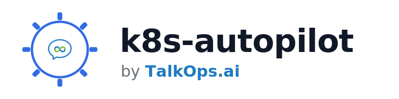

<p align="center">
  
</p>

**A stateful, multi-agent Kubernetes autopilot that orchestrates deployments, progressive GitOps delivery, observability workflows, and safe cluster operations through natural conversation.**

[](https://opensource.org/licenses/Apache-2.0)
[](https://www.python.org/downloads/)
[](https://github.com/langchain-ai/langgraph)
[](https://discord.gg/3nz5MQAA7)
[](https://hub.docker.com/)

[**Quick Start**](#getting-started) •
[**Workflows**](#what-can-it-actually-do) •
[**Architecture**](#architecture) •
[**Report Bug**](#contact)

---

## ⚡ Quick Overview

See **k8s-autopilot** in action using the **Observability Operator** to dynamically generate Prometheus dashboards, analyze CPU utilization across namespaces, and interactively troubleshoot cluster performance:

<video src="https://raw.githubusercontent.com/talkops-ai/k8s-autopilot/main/demo/observability-demo.mp4" autoplay loop muted controls></video>

> *The Observability Operator Coordinator analyzing Prometheus metrics and rendering an interactive CPU utilization dashboard directly in the conversation.*

---

## ❓ Why k8s-autopilot?

k8s-autopilot turns Kubernetes operations into a conversational, multi-agent workflow.

### The Real Problem
If you've spent hours debugging a `CrashLoopBackOff`, trying to figure out why an ArgoCD sync is stuck, or carefully orchestrating a zero-downtime canary rollout, you know the pain of Kubernetes sprawl. It’s not just about writing YAML—it’s about the massive cognitive load of context-switching between `kubectl`, Argo dashboards, Helm releases, Prometheus metrics, Loki logs, and Tempo traces just to safely ship or rollback code.

### Our Solution
**k8s-autopilot** is a stateful, multi-agent AI system built on LangGraph and deep agents that understands cluster context, routes work to specialized operators, and safely executes Kubernetes, GitOps, and observability operations with explicit Human-in-the-Loop approval.

Need to migrate a workload to Argo Rollouts, inspect a failing pod, query Prometheus, trace an incident in Loki or Tempo, or debug an Alertmanager route? The Supervisor Agent delegates the task to the right domain operator, gathers live system context, proposes a plan, and waits for approval before making changes. 

---

## 🚀 What can it actually do?

k8s-autopilot natively supports dozens of complex, multi-step workflows across four major domains. It uses specialized "Skills" to execute these operations safely.

### ☸️ Kubernetes Operations (K8s Operator)
- **Automated Root Cause Analysis:** Ask the agent to "debug my failing pod" and it will automatically pull exit codes, scan previous container logs, check cluster events, and propose a fix for `CrashLoopBackOff` or `ImagePullBackOff`.
- **Resource Pressure Investigation:** Deeply investigate `OOMKilled` containers by correlating pod memory limits with live `nodes_top` and `pods_top` stats.
- **Safe Exec & Ephemeral Debugging:** Spin up temporary debug pods (like `netshoot` or `busybox`) to test DNS and connectivity, or safely exec into running containers.
- **Multi-Cluster Context Switching:** Natively list multi-cluster targets and seamlessly switch kubeconfig contexts for cross-cluster operations.
- **RBAC & Security Inspection:** Audit who has access by querying Roles, RoleBindings, and ServiceAccounts.

### ⛴️ Progressive Delivery (App Operator — Argo Rollouts)
- **Zero-Downtime Migrations:** Seamlessly convert standard K8s Deployments to Argo Rollouts using `workloadRef` without duplicating pods, dropping traffic, or causing ArgoCD GitOps drift.
- **Canary & Blue-Green Orchestration:** Execute step-based canary traffic shifting or instant blue-green cutovers.
- **Automated Rollbacks via Prometheus:** The agent configures `AnalysisTemplates` to automatically monitor error rates and P99 latency during a rollout, aborting instantly if thresholds are breached.
- **A/B Testing Experiments:** Spin up ephemeral baseline vs. candidate pods to shadow-test new images against live production traffic before committing.
- **Emergency Aborts:** Instantly revert traffic back to the stable ReplicaSet during a degraded rollout with a single command.

### 🔄 GitOps & Edge Routing (App Operator — ArgoCD & Traefik)
- **Declarative Onboarding:** Add new GitHub repositories and automatically provision isolated ArgoCD `AppProject` YAML manifests.
- **Automated Sync Debugging:** If an app is `OutOfSync` or `Degraded`, the agent analyzes the ArgoCD sync events and provides actionable remediation.
- **Traefik Edge Routing:** Set up weighted canary routes, TCP routing (Postgres/Redis), and traffic mirroring (shadow launches) at the edge.
- **Resiliency Middlewares:** Automatically attach rate limits, circuit breakers, TLS termination, and IP allowlists to your Traefik routes.
- **NGINX to Traefik Migration:** Automatically translate legacy NGINX Ingress annotations into native Traefik middleware and IngressRoute configurations.

### 📦 Helm Lifecycle (Helm Operator)
- **Intelligent Generation:** The agent reads the official chart `README` and `values.schema.json` to determine exactly which values are mandatory for your specific environment, prompting you only for what matters.
- **Multi-Phase Pipeline:** New chart requests flow through a full pipeline: `helm-planner` → `helm-skill-builder` (if needed) → `helm-generator` → `helm-validator` → HITL approval → `github-agent`.
- **Live Cluster Operations:** The `helm-operation` sub-agent connects to the Helm MCP server for live install, upgrade, rollback, and uninstall operations with a full phased workflow (discovery → planning → dry-run → execution → verification).
- **Live Upgrades & Rollbacks:** Modify active releases using `--reuse-values` or rollback to specific known-good revisions using the persistent operations journal.
- **GitHub Persistence:** Once a chart is generated and approved via HITL, the `github-agent` uses the GitHub MCP to commit the structured chart directly to your repository—no manual copy-pasting required.

### 🔭 Observability (Observability Operator — Prometheus, Alertmanager, OpenTelemetry, Loki & Tempo)
- **PromQL Queries & Metric Exploration:** Ask natural language questions like "how much CPU is my app using?" and the agent translates them into precise PromQL queries via the Prometheus MCP server.
- **Exporter Lifecycle Management:** Deploy, verify, and uninstall Prometheus exporters (Redis, PostgreSQL, etc.) for any service — including automatic health validation after installation.
- **Synthetic Monitoring & Probes:** Set up endpoint monitoring using native Probe CRDs with Blackbox exporter, following the strict sequence: `prom_install_exporter` → `prom_apply_probe` → `prom_query_instant` for validation.
- **Alerting & Recording Rules:** Author and deploy PrometheusRule CRDs (P1/P2 severity alerting rules) directly to Kubernetes namespaces using `k8s_crd` storage mode.
- **TSDB Cardinality & FinOps:** Analyze label cardinality, identify high-cardinality metrics, and optimize storage costs.
- **On-Call Alert Triage:** Get a human-readable on-call summary of all firing alerts, grouped by severity and service, with actionable remediation steps.
- **Silence Lifecycle:** Create, preview blast radius, validate against policy, extend, and expire alert silences — all with mandatory dry-run previews before creation.
- **Routing Audit & Governance:** Inspect Alertmanager routing trees, simulate "who gets paged?" scenarios, and audit default route misconfigurations.
- **Integration Testing:** Push synthetic test alerts to validate that downstream notification channels (Slack, PagerDuty, email) are correctly configured.
- **OpenTelemetry Pipelines & Instrumentation:** Provision collectors, onboard services with auto-instrumentation, audit metric cardinality, optimize sampling, and manage security posture via the OpenTelemetry MCP server.
- **Loki Log Observability:** Discover label schemas, analyze log structures, construct and execute LogQL queries, perform trace-log correlation, and investigate incident response logs.
- **Tempo Distributed Tracing:** Build and execute TraceQL queries, retrieve and summarize traces (critical path, error detection), map service topologies, pivot across pillars (metrics→traces, logs→traces), and manage Tempo Operator CRD lifecycles.

---

## 🏗 Architecture

k8s-autopilot leverages the production-grade **Deep Agent** pattern, operating a multi-tier hierarchy of agents, MCP servers, and HITL gates.


```mermaid
graph TD
    User([User Request]) --> A2A[A2A Protocol / A2UI]
    A2A --> Sup[Supervisor Agent]
    
    Sup -- "Transfer" --> HelmCoord[Helm Operator Coordinator]
    Sup -- "Transfer" --> AppCoord[App Operator Coordinator]
    Sup -- "Transfer" --> K8sCoord[K8s Operator Coordinator]
    Sup -- "Transfer" --> ObsCoord[Observability Coordinator]
    
    subgraph "Helm Operator Domain"
        HelmCoord --> HPlanner[helm-planner]
        HelmCoord --> HSkill[helm-skill-builder]
        HelmCoord --> HGen[helm-generator]
        HelmCoord --> HVal[helm-validator]
        HelmCoord --> HUpdate[helm-updater]
        HelmCoord --> HOp[helm-operation]
        HelmCoord --> GitHub[github-agent]
    end
    
    subgraph "App Operator Domain"
        AppCoord --> ArgoCD[argocd-onboarder]
        AppCoord --> ArgoR[argo-rollouts-onboarder]
        AppCoord --> Traefik[traefik-edge-router]
    end
    
    subgraph "K8s Operator Domain"
        K8sCoord --> K8sOp[k8s-cluster-ops]
    end
    
    subgraph "Observability Domain"
        ObsCoord --> PromOp[prometheus-operator]
        ObsCoord --> AMOp[alertmanager-operator]
        ObsCoord --> OTelOp[opentelemetry-operator]
        ObsCoord --> LokiOp[loki-operator]
        ObsCoord --> TempoOp[tempo-operator]
    end
    
    HVal -.-> HMCP[(Helm MCP)]
    HOp -.-> HMCP
    GitHub -.-> GMCP[(GitHub MCP)]
    ArgoCD -.-> AMCP[(ArgoCD MCP)]
    ArgoR -.-> ARMCP[(Argo Rollouts MCP)]
    Traefik -.-> TMCP[(Traefik MCP)]
    K8sOp -.-> KMCP[(Kubernetes MCP)]
    PromOp -.-> PMCP[(Prometheus MCP)]
    AMOp -.-> AlertMCP[(Alertmanager MCP)]
    OTelOp -.-> OTelMCP[(OpenTelemetry MCP)]
    LokiOp -.-> LokiMCP[(Loki MCP)]
    TempoOp -.-> TempoMCP[(Tempo MCP)]
```

### The Flow in Practice:
1. **Intent Extraction**: The Supervisor reads your request (e.g., "Deploy my frontend with zero downtime") and routes it to the App Operator.
2. **Read-Only Discovery**: The App Operator queries the Kubernetes/ArgoCD MCP to understand the current state.
3. **Planning & Approval**: A robust, step-by-step plan is generated and presented via the UI for your explicit approval (`[PLAN-LOCKED]`).
4. **Execution**: The specialized sub-agent (e.g., `argo-rollouts-onboarder`) executes the pre-approved plan via the connected MCP server.
5. **Summarization**: The agent logs the operation in its persistent journal and presents a formatted Markdown summary of the results.

### JIT MCP Connections

Sub-agents that interact with external systems use a **Just-In-Time (JIT)** connection pattern. Instead of holding open connections to all 7 MCP servers for the entire session, each sub-agent is wrapped in a `CompiledSubAgent` that only opens its MCP connection when that specific node is executed inside the LangGraph. The connection is closed immediately after the sub-agent completes, keeping resource usage minimal even with many registered tools.

### Cross-Domain Handoff Protocol

When a coordinator determines that a user's request belongs to a different domain, it emits a structured signal: `"This is outside my scope. Please use the appropriate operator."` along with `User Request:` and `Context:` sections. The Supervisor detects this via pattern matching, extracts structured context, and immediately re-routes to the correct coordinator with a `[CROSS-DOMAIN]` prefix — injecting the prior coordinator's findings so the user never has to repeat themselves.

This "blackboard pattern" enables seamless multi-domain investigations. For example:
- User asks the Observability operator about checkout service alerts → discovers 5 critical alerts.
- Observability operator defers pod inspection to K8s operator.
- Supervisor auto-routes: `[CROSS-DOMAIN] Source: observability. Prior findings: 5 critical alerts for checkout. User Request: Check pod status.`
- K8s operator receives full context and executes immediately without re-asking.

### Sub-Agent Reference

| Domain | Sub-Agent | MCP Server | Connection | HITL Gated |
| :--- | :--- | :--- | :--- | :--- |
| **Helm** | `helm-planner` | — | Compiled Subgraph | No |
| **Helm** | `helm-skill-builder` | — | Static Dict | No |
| **Helm** | `helm-generator` | — | Static Dict | No |
| **Helm** | `helm-validator` | — | Static Dict | No |
| **Helm** | `helm-updater` | — | Static Dict | No |
| **Helm** | `helm-operation` | `helm_mcp_server` | JIT MCP | ✅ |
| **Helm** | `github-agent` | `github_mcp` | JIT MCP | No |
| **App** | `argocd-onboarder` | `argocd_mcp_server` | JIT MCP | ✅ |
| **App** | `argo-rollouts-onboarder` | `argo_rollout_mcp_server` | JIT MCP | ✅ |
| **App** | `traefik-edge-router` | `traefik_mcp_server` | JIT MCP | ✅ |
| **K8s** | `k8s-cluster-ops` | `kubernetes_mcp_server` | JIT MCP | ✅ |
| **Observability** | `prometheus-operator` | `prometheus-mcp-server` | JIT MCP | ✅ |
| **Observability** | `alertmanager-operator` | `alertmanager-mcp-server` | JIT MCP | ✅ |
| **Observability** | `opentelemetry-operator` | `opentelemetry-mcp-server` | JIT MCP | ✅ |
| **Observability** | `loki-operator` | `loki-mcp-server` | JIT MCP | No |
| **Observability** | `tempo-operator` | `tempo-mcp-server` | JIT MCP | ✅ |

---

## 🛑 Human-in-the-Loop — Governance You Can Trust

AI shouldn't arbitrarily execute state-modifying operations on your cluster. k8s-autopilot enforces strict **Human-in-the-Loop (HITL)** governance at multiple layers.

- **Read-Only Operations**: Queries like "list pods" or "check sync status" execute instantly — no approval needed.
- **State-Modifying Operations**: Operations like "deploy app", "scale deployment", or "rollback release" trigger the `HumanInTheLoopMiddleware`. The agent constructs a clear plan, pauses the LangGraph execution via `interrupt()`, and renders an interactive approval card in the UI. **Nothing is modified until you click Approve.**
- **Commit Gates**: For Helm charts, the agent will never push code to a repository without explicitly pausing to ask for your confirmation and branch details.

### The `[PLAN-LOCKED]` Delegation Protocol

Every state-modifying operation follows a mandatory **Intent → Plan → Approve → Execute** lifecycle:

1. **Intent Extraction**: The coordinator translates the user's request into DevOps-aware parameters.
2. **Plan Presentation**: A structured plan is presented via `request_user_input` with action details, resource names, namespaces, and impact assessment.
3. **User Approval**: The LangGraph execution pauses (`interrupt()`) and the UI renders an approval card. The user must explicitly approve.
4. **`[PLAN-LOCKED]` Execution**: After approval, the coordinator delegates to the sub-agent with the `[PLAN-LOCKED]` prefix: `task(sub-agent): "[STATE-MODIFYING] [PLAN-LOCKED] Execute exactly as specified..."`. This prefix tells the sub-agent to **skip its own planning phase** and execute the pre-approved parameters directly.
5. **Mechanical HITL Backstop**: Even with `[PLAN-LOCKED]`, the `HumanInTheLoopMiddleware` still gates the actual MCP tool call as a background safety net.

### Rejection Protocol

If a user rejects a plan, the agent does **not** retry autonomously with modified parameters. It asks the user what to adjust, with a maximum of 2 plan presentations per request before asking the user to rephrase.

---

## 🧠 Skills, Memory & Context Engineering

k8s-autopilot maintains persistence and context awareness using a multi-layered virtual filesystem backed by a `CompositeBackend` that routes paths to different storage engines:

| Virtual Path | Backend | Purpose |
| :--- | :--- | :--- |
| `/skills/` | `StateBackend` (LangGraph state) | Operational workflow instructions loaded by sub-agents |
| `/memories/` | `StoreBackend` (InMemoryStore, org-scoped) | Governance files and operations journals |
| `/workspace/` | `FilesystemBackend` (real disk) | Generated chart files, synced via `sync_workspace_to_disk` |
| `/shared/` | `StoreBackend` (shared namespace) | Cross-domain shared context |

### Skills (`/skills/`)

Skills are strict operational playbooks that dictate exactly how each sub-agent must interact with MCP servers. Each skill directory contains a `SKILL.md` (YAML frontmatter + step-by-step workflow) and a `references/` directory with domain-specific patterns.

| Domain | Skill Directory | Sub-Agent |
| :--- | :--- | :--- |
| **Helm** | `helm-operator/helm-generator` | helm-generator |
| **Helm** | `helm-operator/helm-skill-builder` | helm-skill-builder |
| **Helm** | `helm-operator/helm-operation` | helm-operation |
| **Helm** | `helm-operator/helm-validator` | helm-validator |
| **Helm** | `helm-operator/helm-updater` | helm-updater |
| **Helm** | `helm-operator/github-agent` | github-agent |
| **App** | `app-operator/argocd-gitops` | argocd-onboarder |
| **App** | `app-operator/argo-rollouts-gitops` | argo-rollouts-onboarder |
| **App** | `app-operator/traefik-edge-routing` | traefik-edge-router |
| **K8s** | `k8s-operator/kubernetes-cluster-ops` | k8s-cluster-ops |
| **Observability** | `observability/prometheus` | prometheus-operator |
| **Observability** | `observability/alertmanager` | alertmanager-operator |
| **Observability** | `observability/opentelemetry` | opentelemetry-operator |
| **Observability** | `observability/loki` | loki-operator |
| **Observability** | `observability/tempo` | tempo-operator |

### Memory (`/memories/`)

Each domain maintains two static governance files pre-seeded into the `InMemoryStore` at startup:

- **`AGENTS.md`**: Defines agent interaction patterns, HITL gate schemas (button layouts, input fields), and parameter completeness lookup tables.
- **`hitl-policies.md`**: Governance rules defining when HITL approval is mandatory vs. optional for each operation type.

### Operations Journal (`operations-log.md`)

The operations journal is the primary mechanism for **context persistence across conversation turns**. It solves a critical problem: when the LLM's conversation history is summarized (compressed), operational details like chart URLs, release names, and namespace targets are lost.

The journal uses a 3-layer context engineering architecture:

1. **Layer 1 — Tool writes**: After every state-modifying operation, the coordinator calls `log_*_operation` (e.g., `log_helm_operation`, `log_app_operation`, `log_k8s_operation`, `log_obs_operation`) to write a structured entry to `/memories/{domain}/operations-log.md`.
2. **Layer 2 — Middleware re-injects**: The `OperationContextMiddleware` (`before_model` hook) reads the journal and re-injects it as a `SystemMessage` before every coordinator model call — surviving summarization.
3. **Layer 3 — Prompt engineering**: Coordinator prompts, sub-agent prompts, and SKILL.md files all instruct the LLM to reference the journal for follow-up operations before asking the user.

Journals are capped at 20 entries with automatic trimming of the oldest entries.

### Supervisor Context Engineering

The Supervisor agent uses its own 3-layer middleware stack to maintain routing accuracy across long sessions:

1. **`SupervisorContextMiddleware`**: Re-injects accumulated domain summaries (what each coordinator accomplished) as a `SystemMessage` before every model call — ensuring cross-domain awareness survives summarization.
2. **`SummarizationMiddleware`**: Auto-compresses conversation history when it exceeds ~75% of the context budget (default: 4000 tokens), keeping only the last 6 messages.
3. **`ModelCallLimitMiddleware`**: Caps model calls at 15 per turn to prevent runaway routing loops — exits gracefully instead of throwing exceptions.

---

## 🛠 Tech Stack

| Component | Technology | Purpose |
| :--- | :--- | :--- |
| **Agent Framework** | `deepagents` / LangGraph | State machine, orchestration, sub-graph routing. |
| **LLM Interface** | LangChain Core | Tool execution, message schemas. |
| **Tools/Integrations**| Model Context Protocol (MCP)| Standardized protocol for Helm, Argo, Traefik, K8s, GitHub, Prometheus, Alertmanager, OpenTelemetry, Loki, Tempo. |
| **User Interface** | A2UI / TalkOps A2A | Real-time streaming, HITL approval cards, markdown rendering. |
| **Runtime** | Python 3.12+ | Core agent backend. |

### MCP Servers

k8s-autopilot connects to **7 MCP servers** — 6 TalkOps-native servers (PyPI packages, stdio transport) and 1 third-party (npx). All MCP servers default to **stdio transport** for in-process communication. Docker Compose deployments can override to HTTP transport.

| MCP Server | Package / Command | Transport | Domain |
| :--- | :--- | :--- | :--- |
| `helm_mcp_server` | `helm-mcp-server` | stdio | Helm chart operations |
| `argocd_mcp_server` | `argocd-mcp-server` | stdio | ArgoCD GitOps |
| `traefik_mcp_server` | `traefik-mcp-server` | stdio | Traefik edge routing |
| `argo_rollout_mcp_server` | `argo-rollout-mcp-server` | stdio | Argo Rollouts progressive delivery |
| `prometheus-mcp-server` | `prometheus-mcp-server` | stdio | Prometheus monitoring & PromQL |
| `alertmanager-mcp-server` | `alertmanager-mcp-server` | stdio | Alertmanager alerting & silences |
| `opentelemetry-mcp-server` | `opentelemetry-mcp-server` | stdio | OpenTelemetry pipelines |
| `loki-mcp-server` | `loki-mcp-server` | stdio | Loki log observability |
| `tempo-mcp-server` | `tempo-mcp-server` | stdio | Tempo distributed tracing |
| `github_mcp` | GitHub Copilot API | HTTP | GitHub file operations |
| `kubernetes_mcp_server` | `npx kubernetes-mcp-server@latest` | stdio | Raw Kubernetes cluster ops |

---

## ⚙️ Configuration

The agent dynamically loads configuration from `.env` or `default.py` and uses a three-tier LLM configuration—different models for different jobs:

| Tier | Used by | Default | Why |
|------|---------|---------|-----|
| **Standard** | `LLM_MODEL` (e.g., fast parsing) | `gpt-4o-mini` | Fast and cost-effective for repetitive tasks and validation parsing |
| **Higher** | `LLM_HIGHER_MODEL` (Supervisor) | `gpt-5-mini` | Stronger reasoning for accurate routing and HITL context generation |
| **Deep Agent** | `LLM_DEEPAGENT_MODEL` (Coordinators) | `o4-mini` | Maximum capability for complex code generation and execution planning |

> **Switching LLM providers:** Set `LLM_PROVIDER` (or `LLM_HIGHER_PROVIDER`, `LLM_DEEPAGENT_PROVIDER`) to `anthropic`, `google_genai`, `openai`, or `azure`. The system supports all of them natively.

For the full list of configuration options—including your active MCP servers—see [`k8s_autopilot/config/default.py`](k8s_autopilot/config/default.py).

---

## 🚀 Getting Started

### Prerequisites
- Docker & Docker Compose
- Kubernetes Cluster (local Minikube/Kind or remote) with KUBECONFIG
- Python 3.12+ (if running from source)
- An LLM Provider API Key (OpenAI, Anthropic, or Gemini)

### Quick Start with Docker Compose (recommended)

No cloning required. You just need two files: `docker-compose.yml` and `.env`.

> **Note:** All MCP servers (Helm, ArgoCD, Traefik, Argo Rollouts, Prometheus, Alertmanager) run **in-process via stdio transport** — no sidecar containers needed. The only external dependency is the Kubernetes MCP server (`npx`).

**1. Create a `docker-compose.yml`** — copy from this repo's [`docker-compose.yml`](docker-compose.yml), or use:

```yaml
services:
  k8s-autopilot:
    image: talkopsai/k8s-autopilot:latest
    container_name: k8s-autopilot
    ports:
      - "10102:10102"
    environment:
      # Required: API Keys (loaded from .env file in the same directory)
      - GOOGLE_API_KEY=${GOOGLE_API_KEY}
      - GOOGLE_GENAI_USE_VERTEXAI=${GOOGLE_GENAI_USE_VERTEXAI}

      # Github MCP Server Configuration
      - GITHUB_MCP_URL=${GITHUB_MCP_URL}
      - GITHUB_PERSONAL_ACCESS_TOKEN=${GITHUB_PERSONAL_ACCESS_TOKEN}
      - HELM_WORKSPACE=${HELM_WORKSPACE}

      # MCP Server Configuration
      # Default: stdio transport for TalkOps MCP servers (binaries in the venv).
      # Override MCP_SERVERS with an HTTP JSON array to use HTTP transport instead.
      - >-
        MCP_SERVERS=[
        {"name": "github_mcp", "url": "https://api.githubcopilot.com/mcp/", "transport": "http", "disabled": false, "headers": {}, "auth_token_env_var": "GITHUB_PERSONAL_ACCESS_TOKEN"},
        {"name": "helm_mcp_server", "command": "helm-mcp-server", "transport": "stdio", "args": [], "env": {"MCP_ALLOW_WRITE": "true"}},
        {"name": "argocd_mcp_server", "command": "argocd-mcp-server", "transport": "stdio", "args": [], "env": {"MCP_ALLOW_WRITE": "true"}},
        {"name": "traefik_mcp_server", "command": "traefik-mcp-server", "transport": "stdio", "args": [], "env": {}},
        {"name": "argo_rollout_mcp_server", "command": "argo-rollout-mcp-server", "transport": "stdio", "args": [], "env": {}},
        {"name": "prometheus-mcp-server", "command": "prometheus-mcp-server", "transport": "stdio", "args": [], "env": {}},
        {"name": "alertmanager-mcp-server", "command": "alertmanager-mcp-server", "transport": "stdio", "args": [], "env": {}},
        {"name": "opentelemetry-mcp-server", "command": "opentelemetry-mcp-server", "transport": "stdio", "args": [], "env": {}},
        {"name": "loki-mcp-server", "command": "loki-mcp-server", "transport": "stdio", "args": [], "env": {}},
        {"name": "tempo-mcp-server", "command": "tempo-mcp-server", "transport": "stdio", "args": [], "env": {}},
        {"name": "kubernetes_mcp_server", "command": "npx", "transport": "stdio", "args": ["-y", "kubernetes-mcp-server@latest"]}
        ]

      # LLM Configuration
      - LLM_PROVIDER=${LLM_PROVIDER}
      - LLM_MODEL=${LLM_MODEL}
      - LLM_HIGHER_PROVIDER=${LLM_HIGHER_PROVIDER}
      - LLM_HIGHER_MODEL=${LLM_HIGHER_MODEL}
      - LLM_DEEPAGENT_PROVIDER=${LLM_DEEPAGENT_PROVIDER}
      - LLM_DEEPAGENT_MODEL=${LLM_DEEPAGENT_MODEL}

      # Logging & Kubeconfig
      - LOG_LEVEL=${LOG_LEVEL}
      - KUBECONFIG=/app/.kube/config

      # Observability: Prometheus MCP server env vars
      # Inherited by the prometheus-mcp-server stdio subprocess
      - PROMETHEUS_BASE_URL=${PROMETHEUS_BASE_URL:-http://prometheus-operated.monitoring.svc:9090}
      - PROMETHEUS_VERIFY_SSL=${PROMETHEUS_VERIFY_SSL:-false}
      - PROMETHEUS_BACKEND_ID=${PROMETHEUS_BACKEND_ID:-default}
      - PROMETHEUS_TYPE=${PROMETHEUS_TYPE:-prometheus}

      # Observability: Alertmanager MCP server env vars
      # Inherited by the alertmanager-mcp-server stdio subprocess
      - ALERTMANAGER_BASE_URL=${ALERTMANAGER_BASE_URL:-http://alertmanager-operated.monitoring.svc:9093}
      - ALERTMANAGER_VERIFY_SSL=${ALERTMANAGER_VERIFY_SSL:-false}
      - ALERTMANAGER_BACKEND_ID=${ALERTMANAGER_BACKEND_ID:-default}
      - AM_MAX_SILENCE_MINUTES=${AM_MAX_SILENCE_MINUTES:-1440}
      - AM_SILENCE_WARNING_THRESHOLD=${AM_SILENCE_WARNING_THRESHOLD:-50}

      # ArgoCD: env vars inherited by the argocd-mcp-server stdio subprocess
      - ARGOCD_SERVER_URL=${ARGOCD_SERVER_URL:-https://argocd-server.argocd.svc:443}
      - ARGOCD_AUTH_TOKEN=${ARGOCD_AUTH_TOKEN}
      - ARGOCD_INSECURE=${ARGOCD_INSECURE:-true}
    volumes:
      - ./workspace/helm-charts:/app/workspace/helm-charts
      - ${HOME}/.kube/config:/app/.kube/config:ro
    restart: unless-stopped
    networks:
      - k8s-autopilot-net

  talkops-ui:
    image: talkopsai/talkops:latest
    container_name: talkops-ui
    environment:
      - K8S_AGENT_URL=http://localhost:10102
      - TALKOPS_ENABLE_LOGGING=false
    ports:
      - "8080:80"
    depends_on:
      - k8s-autopilot
    restart: unless-stopped
    networks:
      - k8s-autopilot-net

networks:
  k8s-autopilot-net:
    driver: bridge
```

**2. Create a `.env` file** in the same directory with your API keys and configuration:

```bash
# LLM Provider (choose one: google_genai, openai, anthropic, azure)
GOOGLE_API_KEY=your_google_api_key_here
LLM_PROVIDER=google_genai
LLM_MODEL=gemini-3.1-flash-lite-preview
LLM_HIGHER_PROVIDER=google_genai
LLM_HIGHER_MODEL=gemini-3.1-pro-preview
LLM_DEEPAGENT_PROVIDER=google_genai
LLM_DEEPAGENT_MODEL=gemini-3.1-pro-preview

# GitHub (for Helm chart commits)
GITHUB_PERSONAL_ACCESS_TOKEN=your_github_pat_with_repo_scope

# Helm workspace
HELM_WORKSPACE=./workspace/helm-charts

# ArgoCD (update to match your cluster)
ARGOCD_SERVER_URL=https://argocd-server.argocd.svc:443
ARGOCD_AUTH_TOKEN=your_argocd_auth_token_here

# Prometheus & Alertmanager (update to match your cluster)
PROMETHEUS_BASE_URL=http://localhost:9090
ALERTMANAGER_BASE_URL=http://localhost:9093
```

> **Using OpenAI or Anthropic instead?** Set `LLM_PROVIDER=openai` and `LLM_MODEL=gpt-4o` (or `anthropic` / `claude-3-5-sonnet-latest`) in your `.env`. The system supports all of them out of the box. See [`.env.example`](.env.example) for the full list of configuration options.

**3. Start everything:**

```bash
docker compose up -d

# k8s-autopilot Agent running at http://localhost:10102
# TalkOps UI running at http://localhost:8080
```

That's it. Open **http://localhost:8080** and start talking to the orchestrator.

#### From Source

If you want to run it directly (for development or customization):

1. Install [uv](https://docs.astral.sh/uv/getting-started/installation/) for dependency management.

2. Clone the repo and create a virtual environment with Python 3.12:

```bash
git clone https://github.com/talkops-ai/k8s-autopilot.git
cd k8s-autopilot

uv venv --python=3.12
source .venv/bin/activate  # On Unix/macOS
# or
.venv\Scripts\activate  # On Windows
```

3. Install dependencies from `pyproject.toml`:

```bash
uv pip install -e .
```

4. Create a `.env` file and add your environment variables:

```bash
cp .env.example .env
# Edit .env — at minimum set your LLM API key
```

> All available configuration options can be found in [`k8s_autopilot/config/default.py`](k8s_autopilot/config/default.py). You can set any of these via your `.env` file.

5. Start the A2A server:

```bash
k8s-autopilot --host localhost --port 10102
```

To interact with the agent, we recommend using the **TalkOps UI** client. Pull and run it with Docker:

```bash
docker run -d \
  --name talkops-ui \
  -p 8080:80 \
  -e K8S_AGENT_URL=http://host.docker.internal:10102 \
  talkopsai/talkops:latest
```

Then open [http://localhost:8080](http://localhost:8080) in your browser.

## 🛣 What's Next? (Our Roadmap)
We've built a powerful foundation with multi-agent routing, progressive delivery, and deep observability. But we're not stopping there. Here is what we are actively working on next to make k8s-autopilot even better:

- [ ] **Kargo Implementation**: We are bringing native support for [Kargo](https://kargo.akuity.io/) to help orchestrate complex, multi-stage continuous delivery pipelines across your environments.
- [ ] **Autopilot Monitoring & Telemetry**: We want the agent to not just manage your cluster, but also be fully observable itself. We're adding deep monitoring capabilities so you can track the agent's performance, resource usage, and decision-making over time.
- [ ] **Slack/Teams ChatOps Integration**: Bringing the full power of the Supervisor Agent directly into your team's chat platform so you can debug incidents collaboratively.

---

## 💬 FAQ

**Q: Do I need all MCP servers running?**
A: No. The agent can operate with a subset of servers. If a server is unavailable, the relevant deep agent will politely inform you that the capability is disabled.

**Q: Does it support Anthropic or Gemini?**
A: Yes! Simply change `LLM_PROVIDER=anthropic` and set `LLM_MODEL=claude-3-5-sonnet-latest` in your `.env`.

---

## 🤝 Contributing
Contributions are welcome! Whether it's adding a new MCP server integration, fixing bugs, or improving prompts, please feel free to open a PR. See [CONTRIBUTING.md](CONTRIBUTING.md) for guidelines.

---

## 📝 License
This project is licensed under the Apache 2.0 License - see the [LICENSE](LICENSE) file for details.

---

## 📞 Contact
- **Discord**: [Join the K8s Autopilot Server](https://discord.gg/3nz5MQAA7)
- **GitHub Issues**: [Open an issue](https://github.com/talkops-ai/k8s-autopilot/issues)
