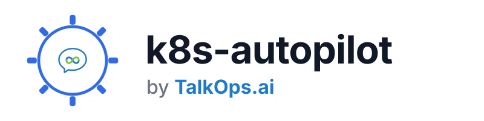
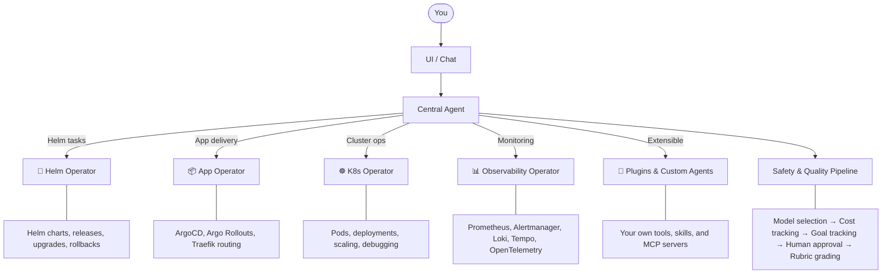

<p align="center">
  
</p>

**An open-source, extensible AI operations framework for Kubernetes — with built-in operators for Helm, GitOps, progressive delivery, and full-stack observability.**

[](https://opensource.org/licenses/Apache-2.0)
[](https://www.python.org/downloads/)
[](https://github.com/langchain-ai/langgraph)
[](https://a2a-protocol.org/latest/)
[](https://hub.docker.com/)
[](https://talkops.ai/slack)

[Quickstart](#quickstart) · [Architecture](#architecture) · [Docs](#documentation) · [Contributing](#contributing)

---

## See It in Action


> The Observability Operator analyzing Prometheus metrics and rendering a CPU utilization dashboard in the conversation.

---

## What Is k8s-autopilot?

k8s-autopilot is an **open-source AI operations framework** built on [LangGraph](https://docs.langchain.com/langgraph) and the [Deep Agents SDK](https://docs.langchain.com/oss/python/deepagents/quickstart). It ships with built-in operators for Helm, ArgoCD, Argo Rollouts, Traefik, Kubernetes cluster ops, and full-stack observability (Prometheus, Alertmanager, Loki, Tempo, OpenTelemetry) — but the framework itself is extensible to any domain.

**What makes it a framework, not just a tool:**

- **Plugin marketplace**: Install plugins from remote marketplaces directly from the UI. Each plugin can bundle skills, sub-agents, and MCP server connectors — extending the agent to any domain you need.
- **Custom MCP servers**: Add any MCP-compliant server from the UI. Custom servers bind directly to the main Deep Agent, giving it access to tools beyond what's built in.
- **Dynamic sub-agents**: Plugins can spawn new sub-agents with dedicated skills and MCP connections. You choose what this agent is capable of doing.
- **UI-driven configuration**: Everything — API keys, model selection, cluster connectivity, backend storage, MCP servers, plugins, skills — is configurable at runtime from the settings UI. No `.env` editing required after initial setup.
- **Goal tracking & rubric grading**: Give the agent a goal and it auto-generates acceptance criteria, works toward it, and a separate grader model checks the results in a loop until every criterion passes — so you know work is actually done, not just attempted.

Nothing is hardcoded beyond the built-in operators and their skills. The user decides what the agent can do.

### How It Compares

| | Kubiya | Komodor | Botkube | kagent | k8s-autopilot |
|---|:---:|:---:|:---:|:---:|:---:|
| **Open source** | No | No | Partial | Yes (CNCF Sandbox) | Yes (Apache 2.0) |
| **Multi-agent** | Yes | No | No | Yes (A2A, per-CRD) | Yes (Supervisor → Operators → Sub-agents) |
| **MCP support** | No | No | No | Yes | Yes (11 built-in + custom from MarketPlace) |
| **Plugin extensibility** | Limited | No | Plugin catalog | MCP tool servers, BYO frameworks | Marketplace: skills, sub-agents, MCP servers |
| **Built-in functionality** | Workflow automation | K8s troubleshooting, cost | K8s event monitoring | General-purpose agent runtime | Helm, ArgoCD, Argo Rollouts, Traefik, Prometheus, Loki, Tempo |
| **HITL governance** | JIT approvals | Approval flows | Chat commands | CRD approval gates | Auto-classifies safe vs. unsafe ops, asks before anything risky |
| **Goal tracking & rubric grading** | No | No | No | No | Yes — set a goal, the agent writes acceptance criteria, works toward it, and a separate grader model checks the work in a loop until every criterion passes |
| **LLM providers** | Not disclosed | Not disclosed | OpenAI | OpenAI, Anthropic, Google, xAI, Ollama | 20+ providers, runtime-switchable from UI |

---

## Quickstart

### 1. Install & Start

```bash
curl -LsSf https://raw.githubusercontent.com/talkops-ai/k8s-autopilot/main/scripts/install.sh | bash
```

> [!NOTE]
> **Windows users:** Run inside **WSL (Windows Subsystem for Linux)** for full compatibility.

The installer checks prerequisites (Docker, Docker Compose, port availability, kubeconfig), pulls the latest images, and starts the stack. Everything is installed to `~/.k8s-autopilot/`.

### 2. Configure from the UI

Open **http://localhost:8888** and go to **Settings**:

| Settings panel | What you can configure |
|---|---|
| **Auth & Keys** | Add or replace API keys for 20+ LLM providers — no restart needed |
| **Plugins** | Browse marketplaces, install plugins with skills and sub-agents |
| **MCP Servers** | Add custom MCP servers, probe status, enable/disable per server |
| **Skills** | View and manage loaded skills per operator |
| **Traces** | LangSmith tracing integration |
| **Runtime Config** | Backend storage (SQLite/PostgreSQL with hot-swap), cluster connectivity (kubeconfig, context, namespace), sandbox provider, approval mode, compaction settings, integration endpoints (Prometheus, Alertmanager, Loki, Tempo, ArgoCD, Traefik), and custom environment variables |

Everything is persisted to the config store (DB-backed) and takes effect immediately — no restart, no redeployment.

### Managing the stack

```bash
# View logs
docker compose -f ~/.k8s-autopilot/docker-compose.yml logs -f

# Stop
docker compose -f ~/.k8s-autopilot/docker-compose.yml down

# Restart
docker compose -f ~/.k8s-autopilot/docker-compose.yml up -d

# Update to latest
curl -LsSf https://raw.githubusercontent.com/talkops-ai/k8s-autopilot/main/scripts/install.sh | bash
```

For detailed setup (from-source, full `docker-compose.yml`, MCP server configuration), see the [Quickstart guide](docs/k8s-autopilot-docs/quickstart.md).

---

## Architecture

k8s-autopilot is built on the [Deep Agents SDK](https://docs.langchain.com/oss/python/deepagents/quickstart) and [LangGraph](https://docs.langchain.com/langgraph). You talk to one central agent, and it delegates work to specialized **sub-agents** (we call them operators) — each one is an expert in a specific domain like Helm, ArgoCD, or monitoring. Out of the box you get 4 built-in operators, but the system is designed so **you** decide what it can do: install plugins from the marketplace to add new sub-agents, attach custom skills, or connect your own MCP tool servers — all from the UI, at runtime, without touching any code.


```mermaid
graph TD
    User([You]) --> UI["UI / Chat"]
    UI --> Agent["Central Agent"]

    Agent -- "Helm tasks" --> Helm["🎡 Helm Operator"]
    Agent -- "App delivery" --> App["📦 App Operator"]
    Agent -- "Cluster ops" --> K8s["☸️ K8s Operator"]
    Agent -- "Monitoring" --> Obs["📊 Observability Operator"]
    Agent -- "Extensible" --> Plugins["🔌 Plugins & Custom Agents"]

    Helm --- HelmTools["Helm charts, releases, upgrades, rollbacks"]
    App --- AppTools["ArgoCD, Argo Rollouts, Traefik routing"]
    K8s --- K8sTools["Pods, deployments, scaling, debugging"]
    Obs --- ObsTools["Prometheus, Alertmanager, Loki, Tempo, OpenTelemetry"]
    Plugins --- PluginTools["Your own tools, skills, and MCP servers"]

    Agent --> Pipeline["Safety & Quality Pipeline"]
    Pipeline --- PipelineDetails["Model selection → Cost tracking → Goal tracking → Human approval → Rubric grading"]
```

### How it works

1. **You ask** — Type what you need in the chat: *"deploy nginx with Helm"*, *"why is my pod crashing?"*, or *"show me error rates for the payments service"*.
2. **The right sub-agent picks it up** — The central agent reads your intent and hands the task to the operator that specializes in that domain (Helm, K8s, Observability, etc.).
3. **It checks your cluster first** — The operator connects to the relevant tools and inspects the current state before proposing any changes.
4. **You approve before anything changes** — A step-by-step plan is shown. Nothing is executed until you say so.
5. **It does the work — and verifies it** — After approval, the operator executes the plan. If you've set a goal, a separate grader checks the results against your acceptance criteria and keeps iterating until everything passes.

For the full operator reference, see [Operators and Sub-agents](docs/k8s-autopilot-docs/operators-and-subagents.md).

---

## Extensibility

k8s-autopilot is designed to grow with your needs. Everything below can be done from the UI — no code changes, no restarts.

### Install plugins from the marketplace

Browse and install plugins with one click. A plugin can add any combination of:

- **Skills** — Step-by-step playbooks that teach the agent (or any sub-agent) how to handle new workflows it didn't know before.
- **Sub-agents** — Entirely new specialist agents with their own tools and skills, just like the built-in operators.
- **MCP servers** — Connectors to additional systems (your internal APIs, CI/CD tools, databases, etc.).

You can point the marketplace at a GitHub repo, an HTTPS URL, or a local folder. Once a plugin is installed, it's live immediately.

**Supported plugin formats** — k8s-autopilot understands plugins built for **Anthropic (Claude)**, **OpenAI (Codex)**, **OpsCode**, or its own native format. If you already have plugins for any of these ecosystems, they work here out of the box.

### Connect your own tools

From Settings, add any MCP-compatible tool server. These plug directly into the central agent, so the agent can use them alongside the built-in operators. If a system speaks MCP, you can connect it.

### Everything is configurable at runtime

No config files to edit, no containers to restart. Switch AI models, add API keys, connect new tools, install plugins, change your database — do it all from the Settings page while the system is running. Every change takes effect immediately.

---

## Human-in-the-Loop Governance

You control how much freedom the agent has. There are three approval modes, and you can switch between them at any time from the UI:

| Mode | What happens |
|---|---|
| **🛡️ Manual** | The agent pauses and asks for your approval before every action that could change something on your cluster. Safest option — nothing happens without your say-so. |
| **🤖 Auto** | The agent uses a built-in safety classifier to decide on its own. Read-only actions (listing pods, checking status) run immediately. Risky actions (deployments, deletions, scaling) are flagged and still require your approval. If the classifier is unsure, it falls back to asking you. |
| **⚡ YOLO** | Everything runs without asking. Designed for development, testing, or CI pipelines where speed matters more than manual review. |

### How Auto mode classifies actions

Auto mode doesn't just have a static list of "safe" and "unsafe" tools. It uses a three-step process:

1. **Known patterns** — Common read-only operations (list, get, describe, status, search) are auto-approved instantly. Known destructive verbs (delete, destroy, drain, purge) always pause for approval.
2. **AI classifier** — For anything in between, the agent's own model evaluates the action and decides whether it's safe to proceed or needs human review.
3. **Human fallback** — If the classifier is unavailable or uncertain, the action is always sent to you for approval. It fails safe, never fails open.

### What the agent can ask you

Beyond approvals, the agent can also ask you questions mid-task when it needs clarification — for example, choosing between two valid approaches or confirming which namespace to target. This uses a separate `ask_user` tool, not the approval system.

See [HITL Governance](docs/k8s-autopilot-docs/hitl-governance.md) for the full protocol.

---

## Built-in Sub-agents

k8s-autopilot ships with 4 domain-specific sub-agents out of the box. Each one is a specialist that connects to its own set of tools (MCP servers) and follows its own playbooks (skills). You can extend the system with more sub-agents via plugins.

| Sub-agent | What it does | Tools it connects to | Skills |
|---|---|---|---|
| **🎡 Helm Operator** | Discovers, installs, upgrades, rolls back, and uninstalls Helm charts. Validates values, renders manifests, and checks prerequisites before any change. | Helm MCP Server (22 tools) | helm-operation |
| **📦 App Operator** | Manages application delivery end-to-end — GitOps with ArgoCD, progressive delivery with Argo Rollouts (canary, blue-green), and edge traffic routing with Traefik. | ArgoCD, Argo Rollouts, Traefik MCP Servers | argocd-gitops, argo-rollout-gitops, traefik-edge-routing |
| **☸️ K8s Operator** | Core cluster operations — listing resources, debugging crashing pods, scaling workloads, reading logs, inspecting RBAC, managing namespaces and contexts. | Kubernetes MCP Server | kubernetes-cluster-ops |
| **📊 Observability Operator** | Full-stack monitoring — PromQL queries, alert triage and silencing, log exploration with LogQL, distributed trace search with TraceQL, and OpenTelemetry instrumentation. | Prometheus, Alertmanager, Loki, Tempo, OpenTelemetry MCP Servers | prometheus, alertmanager, loki, tempo, opentelemetry |

Each sub-agent has its own documentation:

- [Helm Operator](docs/k8s-autopilot-docs/helm-operator.md)
- [App Operator](docs/k8s-autopilot-docs/app-operator.md)
- [K8s Operator](docs/k8s-autopilot-docs/k8s-operator.md)
- [Observability Operator](docs/k8s-autopilot-docs/observability-operator.md)

---

## Documentation

| Guide | What you'll find |
|---|---|
| [Overview](docs/k8s-autopilot-docs/overview.md) | What k8s-autopilot is, how it works, and the overall architecture |
| [Quickstart](docs/k8s-autopilot-docs/quickstart.md) | Install, configure, and run your first task |
| [Configuration](docs/k8s-autopilot-docs/configuration.md) | Environment variables, credentials, settings resolution |
| [Approval Modes](docs/k8s-autopilot-docs/hitl-governance.md) | Manual, Auto, and YOLO — how the agent asks for permission |
| [Goals & Rubrics](docs/k8s-autopilot-docs/goals-and-rubrics.md) | Set goals, auto-generate acceptance criteria, and grade results |
| [Plugins](docs/k8s-autopilot-docs/plugins.md) | Marketplace, plugin formats (Claude, Codex, OpsCode), manifest reference |
| [Memory & Skills](docs/k8s-autopilot-docs/skills-and-memory.md) | Operational playbooks, persistent memory, context engineering |
| [Sub-agents](docs/k8s-autopilot-docs/operators-and-subagents.md) | Built-in operators (Helm, App, K8s, Observability) and custom sub-agents |
| [Model Providers](docs/k8s-autopilot-docs/model-providers.md) | 20+ supported providers, model tiers, extended thinking |
| [MCP Servers](docs/k8s-autopilot-docs/mcp-servers.md) | Connecting tools, transports, and server reference |
| [A2UI & A2A](docs/k8s-autopilot-docs/a2ui-and-a2a.md) | Protocol integration, approval cards, UI surfaces |

---

## Roadmap

- [ ] **Kargo**: Native support for [Kargo](https://kargo.akuity.io/) multi-stage delivery pipelines.
- [ ] **Agent Telemetry**: Self-monitoring for the agent's performance, resource usage, and decision-making.
- [ ] **Slack/Teams ChatOps** Agent integration with team chat platforms.
- [ ] **Playbook Invocations** While debugging a production task , some teams already have built their own playbooks, let's give them the possibility to use these playbooks with this agent.

---

## FAQ

**Do I need all MCP servers running?**
No. The agent operates with whatever subset is available. If a server is missing, the relevant operator will tell you.

**Is this a coding agent?**
No. k8s-autopilot is an operations framework. It connects to live infrastructure via MCP, proposes plans, and executes operations with your approval. It does not write code in an IDE.

**Can I extend it beyond Kubernetes?**
Yes. Install plugins from a marketplace or add custom MCP servers from the UI. Any MCP-compliant tool server can be integrated.

**How is this different from ChatGPT or Copilot?**
ChatGPT and Copilot are coding assistants — they generate code in conversations. k8s-autopilot is an operations agent that connects to live cluster infrastructure, proposes operational plans, and executes them through MCP with human approval gates.

---

## Contributing

Contributions welcome — new MCP integrations, bug fixes, prompt improvements. See [CONTRIBUTING.md](CONTRIBUTING.md).

---

## License

Apache 2.0. See [LICENSE](LICENSE).

---

## Contact

- **Slack Community**: [Join TalkOps on Slack](https://talkops.ai/slack)
- **GitHub Issues**: [Open an issue](https://github.com/talkops-ai/k8s-autopilot/issues)
