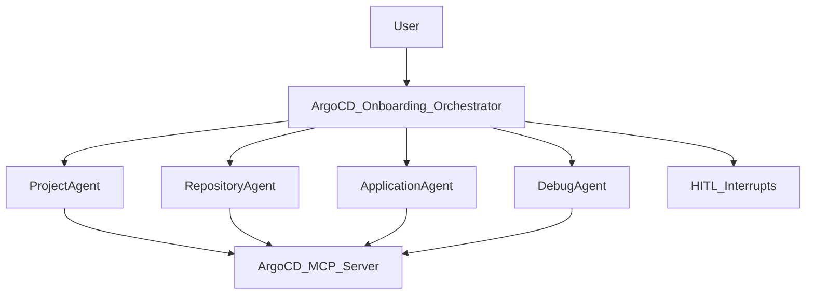

## ArgoCD Onboarding Sub-Agent (K8s Autopilot)

This folder documents the **ArgoCD onboarding sub-agent** inside K8s Autopilot.
In plain terms, it’s a “guided autopilot” that helps you safely manage ArgoCD **projects**, **repositories**, and **applications** by:

- **Understanding** what you want (create/update/delete/sync/list),
- **Checking prerequisites** (what already exists, what is permitted),
- Showing you a **human-friendly plan preview**,
- Then **executing** the steps using the ArgoCD MCP server—**with approval gates** for risky actions.

If you are lightly technical: you can think of this as “a workflow engine + guardrails,” not a chatbot.

---

## What it can do (capabilities)

The sub-agent is organized around four areas:

- **Projects**
  - Create / get / list / update / delete ArgoCD projects
- **Repositories**
  - List / get / onboard (HTTPS/SSH) / delete repositories
  - Validate repository connection (diagnostics)
- **Applications**
  - List / get details / create / update / delete
  - Sync applications, preview diffs, check sync status
  - Validate application config (if the tool is available)
- **Debug**
  - Fetch application logs and events (when troubleshooting)

---

## High-level architecture (layman + technical)

There is one **orchestrator** (the “brains”) and several **specialized sub-agents** (the “hands”).

- The orchestrator is built using a Deep Agent pattern in:
  - `k8s_autopilot/core/agents/onboarding/orchestrator_agent.py`
- The orchestrator delegates to these sub-agents:
  - **ProjectAgent**: project CRUD
  - **RepositoryAgent**: repo list/get/onboard/delete
  - **ApplicationAgent**: app lifecycle and sync operations
  - **DebugAgent**: logs/events collection

All real ArgoCD operations are performed via the **ArgoCD MCP server** (through `MCPAdapterClient`), which means:
- The agent **does not guess** cluster state.
- The agent **retrieves fresh data** before acting.

**ArgoCD MCP server implementation reference**:
- [talkops-ai/talkops-mcp `src/argocd-mcp-server`](https://github.com/talkops-ai/talkops-mcp/tree/main/src/argocd-mcp-server)

Here is the flow at a glance:

---

## What “agentic” means here (vs a chatbot)

This sub-agent is “agentic” because it is designed to:

- **Plan before acting**: It shows a plan preview before doing state-changing work.
- **Validate prerequisites automatically**: It checks whether things exist and whether actions are allowed.
- **Execute with guardrails**: It uses deterministic middleware to stop on missing inputs and to require approvals.
- **Recover and continue**: It retries safe read-only checks when transient failures happen.
- **Keep you in control**: It asks for approval before destructive or risky operations.

In a chatbot, you’d typically see: “Please provide X, please provide Y…” and nothing actually pauses safely.
Here, questions are asked through **explicit interrupts**, and the workflow resumes from the exact point it paused.

---

## How a workflow runs (keeping you in the loop)

The orchestrator follows a simple “phased” workflow (documented in its prompt):

1) **Understand the request**
   - Determine whether this is a read-only query (list/get/status) or a workflow (create/update/delete/sync).

2) **Validate prerequisites**
   - Fetch project/repo/app details as needed (fresh reads).
   - Example: before creating an application, check that:
     - the project exists,
     - the repo is registered and permitted by the project,
     - the app name isn’t already taken (or decide whether to update).

3) **Plan preview**
   - Show a human-friendly plan preview with:
     - goal
     - where it will apply (project + target destination)
     - what will happen
     - what (if anything) is needed from you
     - what approvals will be requested
   - Then the agent **pauses** and asks you to approve/reject the plan.

4) **Execute with checkpoints**
   - Runs the concrete tool calls via MCP.
   - For risky operations, a second “tool-level” approval may be requested (e.g., create app, delete, sync).

5) **Continuous validation**
   - After each step, it verifies success (and can fetch diff/status if needed).

### Where the agent will pause (HITL)

There are three types of “pauses”:

- **Plan review pause**: a single “Approve this plan?” step before state changes.
  - Implemented by the `request_human_input` tool in `orchestrator_agent.py`.
- **Missing required inputs pause**: only happens when a tool call is about to run without required parameters.
  - Implemented by `ArgoCDMissingInputsHITLMiddleware`.
- **Tool-level approval pause**: for destructive or high-impact operations.
  - Implemented by `ArgoCDApprovalHITLMiddleware` using approval templates.

---

## Middleware components (what they do, in plain English)

Middleware is where most of the “agentic” reliability comes from. The core ArgoCD middleware lives in:
`k8s_autopilot/core/agents/onboarding/middleware/__init__.py`.

### `ArgoCDStateMiddleware` (state + audit trail)
What it does:
- Updates the structured state after each tool call (projects/repos/apps).
- Writes an **execution log** entry and an **audit log** entry.
- Includes basic **de-duplication**: if the same tool is called with the same key args, it can return a cached response.

Why it matters:
- The agent can “remember what it already checked” in a controlled way, without guessing.
- The user can see what happened (via logs and final summaries).

### `ArgoCDMissingInputsHITLMiddleware` (deterministic missing-arg gate)
What it does:
- Before executing certain tools, it checks required args.
- If something is missing, it pauses and asks you for just those missing fields.
- It supports **aliases** for common parameter-name variations (so we don’t ask you again due to naming differences).
- It also applies **safe defaults** in some cases (e.g., destination namespace defaults) to reduce unnecessary back-and-forth.

Why it matters:
- Prevents the agent from calling tools with incomplete args.
- Prevents “chatbot behavior” where it asks a question but the workflow ends instead of pausing.

### `ArgoCDApprovalHITLMiddleware` (tool-level approvals)
What it does:
- Wraps high-impact operations with an explicit approval interrupt using a standardized template:
  - create application (always)
  - delete application/project
  - sync application (and stronger messaging for production-like namespaces)
- For destructive actions (delete), it can require a second step: **type the name exactly**.

Why it matters:
- Protects against accidental destructive changes.
- Makes approvals consistent and UI-friendly.

### `ArgoCDErrorRecoveryMiddleware` (safe retries)
What it does:
- Retries a limited set of safe, read-only/idempotent tools on transient failures.

Why it matters:
- Reduces “try again” manual steps for users when the underlying API is flaky.

---

## State management schema (what the agent tracks)

The ArgoCD onboarding agent uses `ArgoCDOnboardingState` in:
`k8s_autopilot/core/state/base.py`.

In plain terms, it keeps:

- **Conversation + session**
  - `messages`, `user_request`, `session_id`
- **Project state**
  - `project_info`, `project_list`, `project_created`
- **Repository state**
  - `repository_info`, `repository_list`, `repo_onboarded`
- **Application state**
  - `application_info`, `application_list`, `application_details`, `application_created`
- **Approvals**
  - `approval_checkpoints`, `approval_status`, phase checkpoints
- **Audit + execution logs**
  - `audit_log`, `execution_logs`
- **Error tracking**
  - `errors`, `warnings`, `last_error`

Why this matters:
- It is the “source of truth” during a workflow, so the agent can make consistent decisions and keep you updated.

---

## How onboarding an application typically looks (example)

Example user request:
- “Onboard the application from repository X located at path Y.”

Typical flow:
- Check project (create if needed)
- Check repo is registered and permitted by the project
- Create application pointing at repo/path
- Optionally preview diff and sync (only if asked)

You will see:
- A **plan preview** (human-friendly)
- A **plan approval** pause
- A **final tool-level approval** before creating the application

---

## How delete typically looks (example)

Example user request:
- “Delete application hello-world”

Typical flow:
- Fetch application details (so we can show correct project/namespace where possible)
- Show plan preview + plan approval
- Show delete approval template + exact-name confirmation
- Execute delete via MCP

---

## Safety and UX principles (what we enforce)

- **No guessing**: Always query the ArgoCD MCP server for fresh state.
- **No secrets in chat**: Repo credentials are assumed to be configured on the server side; we do not request private keys/tokens in chat.
- **One plan preview**: The user sees what will happen before changes are made.
- **Deterministic pauses**: The workflow pauses via interrupts; it doesn’t “end with questions.”
- **Consistent approvals**: Create/delete/sync have standardized approval templates.

