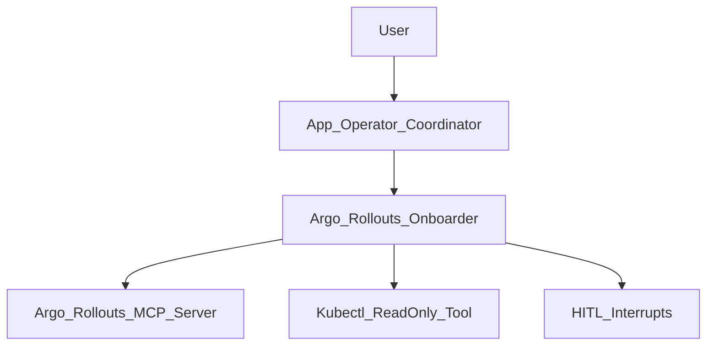

## Argo Rollouts Onboarding Sub-Agent (K8s Autopilot)

This folder documents the **Argo Rollouts onboarding sub-agent** inside K8s Autopilot.
In plain terms, it’s a “guided progressive delivery autopilot” that helps you safely manage **migrating deployments**, **canary/blue-green deployments**, and **rollout lifecycles** by:

- **Understanding** what you want (migrate/update image/promote/abort/check status),
- **Checking prerequisites** (what exists, what is healthy, is Prometheus connected?),
- Showing you a **human-friendly plan preview** (with generated YAML for review),
- Then **executing** the steps using the Argo Rollout MCP server—**with strict approval gates** for destructive or high-risk actions.

If you are lightly technical: you can think of this as “a progressive delivery workflow engine + guardrails,” not a simple chatbot.

---

## What it can do (capabilities)

The sub-agent is organized around four major capability areas:

### 1. Migrations & Manifest Generation
- **Validate Readiness**: Runs pre-flight checks on existing Deployments before any migration is attempted.
- **Convert to Rollout**: Automatically transforms existing standard Kubernetes Deployments into Argo Rollouts. It supports `direct` replacement mode or the safer `workloadRef` mode (which simply references an existing Deployment to avoid pod duplication, ideal for ArgoCD-managed apps).
- **Reverse Migration**: Safely un-rolls an Argo Rollout back into a standard Kubernetes Deployment if you need to opt-out of progressive delivery.
- **Generate Services & Configs**: Automatically creates necessary stable and canary Services for traffic routing, and generates `ignoreDifferences` blocks for ArgoCD to prevent endless sync loops.

### 2. Lifecycle Orchestration
- **Create & Update**: Initialize fresh rollouts or update images, traffic routing settings, and strategy configurations on live ones.
- **Promote & Full Promote**: Advance canary weights manually or automatically. The `promote_full` action skips remaining analysis steps and commits 100% traffic to the new version.
- **Pause, Resume, & Abort**: Intervene in an active rollout to halt progression, restart paused steps, or trigger an emergency abort to immediately dump all traffic back to the stable replica set.
- **Skip Analysis**: Force a rollout forward when metrics providers are down (highly restricted with explicit user warnings).
- **Delete**: Tear down rollouts and their associated ReplicaSets and Services safely.

### 3. Validation, Traffic, & Observation
- **AnalysisTemplates**: Configures Prometheus-backed AnalysisTemplates, setting up the exact metrics and thresholds that will gate future canary promotions.
- **Experiments**: Spin up and tear down ephemeral A/B testing pods that exist independently of the main rollout traffic.

### 4. Read-Only / Fast Path (Observability)
- List rollouts, inspect live phase status, check cluster health and deep details of a specific rollout.
- Pull Prometheus metrics natively to verify traffic split success.
- Review rollout history and revision details.
- *Kubectl Diagnostics*: If the MCP data is insufficient, the agent has secure access to a `kubectl_readonly` tool to pull raw pod events, describe CRDs, and view raw logs to debug failing canary steps.

---

## Tool Reference Guide (Internal Capabilities)

The sub-agent executes actions using specific tools bound to the MCP server. Here is a comprehensive list of its internal capabilities:

| Tool Name | Mutates Cluster | Purpose |
|-----------|-----------------|---------|
| `validate_deployment_ready` | No | Pre-flight readiness check before any migration. |
| `convert_deployment_to_rollout` | Yes (`apply` flag) | Convert existing Deployment to Rollout; auto-preserves probes/limits/env. |
| `convert_rollout_to_deployment` | Yes (`apply` flag) | Reverse migration back to standard K8s Deployment. |
| `argo_manage_legacy_deployment` | Yes | Scale/delete legacy Deployment ONLY after workloadRef migration. |
| `create_stable_canary_services` | Yes (`apply` flag) | Generate stable+canary Services. |
| `generate_argocd_ignore_differences` | No | Generate ArgoCD `ignoreDifferences` config for Rollout integration. |
| `argo_create_rollout` | Yes | Create new Rollout from scratch (no existing Deployment). |
| `argo_update_rollout` | Yes | Update image, strategy config, traffic routing, or workloadRef. |
| `argo_manage_rollout_lifecycle` | Yes | Execute `promote`, `promote_full`, `pause`, `resume`, `abort`, or `skip_analysis`. |
| `argo_delete_rollout` | Yes | Remove Rollout from cluster. |
| `argo_configure_analysis_template` | Yes (`mode` flag) | Create+link Prometheus AnalysisTemplate or generate YAML. |
| `argo_create_experiment` | Yes | Create ephemeral A/B experiment pods. |
| `argo_delete_experiment` | Yes | Clean up experiment runs. |

---

## High-level architecture (layman + technical)

There is one **orchestrator** (the “brains”) and several **specialized sub-agents** (the “hands”).

- The orchestrator delegates progressive delivery workflows to:
  - **argo-rollouts-onboarder**: The specialized agent that understands progressive delivery concepts.

All real Argo Rollouts operations are performed via the **Argo Rollout MCP Server** and the `kubectl_readonly` utility tool. This means:
- The agent **does not guess** cluster state. It always looks at the live cluster.
- The agent **retrieves fresh data** before planning or executing any action.

**Argo Rollouts MCP server implementation reference**:
- [talkops-ai/talkops-mcp `src/argo-rollout-mcp-server`](https://github.com/talkops-ai/talkops-mcp/tree/main/src/argo-rollout-mcp-server)

Here is the flow at a glance:

---

## What “agentic” means here (vs a chatbot)

This sub-agent is “agentic” because it is designed to:

- **Plan before acting**: It presents a clear summary of intended changes. When mutating the cluster, it uses a `generate-before-apply` protocol (first generating YAML, showing it to you, and only applying it if you agree).
- **Validate prerequisites automatically**: It runs readiness validations and idempotency checks. It will never try to create a rollout that already exists or migrate a broken deployment.
- **Execute with guardrails**: It uses deterministic middleware to stop and require human approvals for dangerous tasks.
- **Keep you in control**: It handles approvals via explicit interrupts (pauses). If you reject a plan, it stops cleanly instead of infinitely looping or arguing.
- **Monitor post-action**: After it updates an image or promotes a step, it subscribes to the cluster state and watches the rollout's phase transitions until it stabilizes (Healthy) or fails.

In a standard chatbot, you’d typically see: “Please provide X, please provide Y…” and it might hallucinate missing parameters. Here, questions are asked through explicit interrupts, and the workflow resumes from the exact point it paused.

---

## How a workflow runs (keeping you in the loop)

The orchestrator follows a simple “phased” workflow (documented in its system prompt and `SKILL.md` file):

1) **Explore / Understand the request**
   - The agent reads your request and checks the shared operations journal (`operations-log.md`) for recent context.
   - It determines if you are just checking status (read-only fast path) or if you want to mutate state.

2) **Validate prerequisites (Idempotency)**
   - Fetch existing Rollout/Deployment state using the MCP server.
   - For example: before converting a deployment to a rollout, it calls `validate_deployment_ready` and `argorollout://rollouts/{ns}/{name}/detail` to make sure the target is healthy and not already migrated.

3) **Plan preview**
   - Show a human-friendly plan preview with:
     - The goal.
     - The generated YAML (if migrating or creating templates).
     - The exact strategy it defaults to (e.g., 5% -> 10% -> 25% -> 50% -> 100% pause gates).
     - What approvals will be requested.
   - The agent **pauses** and asks you to approve/reject the plan.

4) **Execute with checkpoints**
   - Runs the concrete tool calls via MCP.
   - If the task contains `[PLAN-APPROVED]`, it skips its own internal plan generation and proceeds directly to execution.
   - For risky operations, a second “tool-level” approval is requested (e.g., deleting an experiment, full promotion).

5) **Continuous validation**
   - After updating, it subscribes to `argorollout://rollouts/{ns}/{name}/detail`.
   - If a canary step pauses, it reads `argorollout://metrics/{ns}/{svc}/summary` to verify success before recommending further promotion.

### Where the agent will pause (HITL)

There are three types of “pauses”:

- **Plan review pause**: A single “Approve this plan?” step before any execution begins.
- **Missing required inputs pause**: Happens when the LLM attempts to call a tool without required parameters (e.g., forgetting the namespace).
- **Tool-level approval pause**: High-impact operations explicitly trigger middleware interrupts.

---

## Middleware components (what they do, in plain English)

Middleware is where the K8s Autopilot guarantees reliability and prevents hallucinations.

### `AppOperationContextMiddleware` (state + audit trail)
What it does:
- Reads `/memories/app-operator/operations-log.md` and injects recent operation details as a `SystemMessage` right before the LLM generates a response.
Why it matters:
- This context survives LangChain's built-in summarization routines, ensuring the agent never "forgets" what namespace or rollout it just created five steps ago.

### `PlanLockMiddleware` (enforces plan fidelity)
What it does:
- Reads the Deep Agent's native `state["todos"]` or the file `/plan/active-plan.md`.
- Re-injects the approved plan as a strict, binding constraint (`ACTIVE PLAN (LOCKED — DO NOT DEVIATE)`).
Why it matters:
- Like a Terraform plan/apply mechanism, it strictly limits the agent to the steps you already approved. The agent cannot spontaneously decide to deviate.

### `HumanInTheLoopMiddleware` (tool-level approvals)
What it does:
- Wraps specific tool executions with an interactive approval card.
- For Argo Rollouts, it triggers on tools like:
  - `argo_delete_rollout` and `argo_delete_experiment` (Destructive actions)
  - `convert_deployment_to_rollout` and `convert_rollout_to_deployment` (Migrations with `apply=True`)
  - `argo_manage_rollout_lifecycle` (Specifically actions like `promote_full`, `skip_analysis`, and `abort`)
  - `argo_create_rollout` and `argo_configure_analysis_template`
  - `argo_manage_legacy_deployment` (Direct cluster mutations)
- Provides **elevated visual warnings (`🚨 PRODUCTION`)** if targeting namespaces like `prod`, `production`, `live`, or `prd`.

Why it matters:
- Protects against accidental destructive changes.
- Ensures the `generate-before-apply` protocol cleanly works—the tool is called with `apply=False`, you review the output, and only when it calls `apply=True` does the approval gate kick in to make cluster changes.

---

## How migrating a deployment typically looks (example)

Example user request:
- “Migrate the backend-api deployment to an Argo Rollout with canary steps.”

Typical flow:
- The agent calls `validate_deployment_ready` on `backend-api` in the default namespace.
- It sees it is managed by ArgoCD, so it defaults to `mode=workloadRef` (to prevent pod duplication).
- It generates the rollout manifest with default canary steps (5%, 10%, 25%, 50%, 100%) and calls `convert_deployment_to_rollout(apply=False)`.
- It shows you the plan and the generated YAML.
- You approve the plan.
- It calls `convert_deployment_to_rollout(apply=True)`. The HITL middleware pauses execution and asks you to confirm cluster mutation.
- You confirm. The agent applies the CRD.
- The agent calls `generate_argocd_ignore_differences` and instructs you to add the block to your ArgoCD Application manifest.

---

## How canary promotion typically looks (example)

Example user request:
- “Promote the backend-api rollout.”

Typical flow:
- The agent checks the rollout status via `argorollout://rollouts/{ns}/{name}/detail`.
- It notices the rollout is paused at the 25% step.
- It fetches Prometheus metrics to ensure the 25% canary pods are not throwing elevated 5xx errors.
- It reports: *"Step 3/5 — 25% canary traffic → [metrics look healthy] → proposing promotion to 50%."*
- It calls `argo_manage_rollout_lifecycle(action="promote")`.
- It subscribes to the phase updates until the rollout settles at the new step.

---

## Safety and UX principles (what we enforce)

- **Autonomous Promotion Ceiling**: The agent may promote canary steps autonomously (without bothering you) up to 50% traffic weight based on healthy metrics. However, at or above 50%, it forces a pause and requires human approval before advancing to `promote_full`.
- **Generate before apply**: Any generation tool must first be called with `apply=False` to show you the YAML. Only after you confirm does it run `apply=True`.
- **Abort before promote on degraded**: If a rollout detail shows `phase=Degraded`, the agent will refuse to promote it. Instead, it will automatically issue an `abort` command to dump traffic back to the stable replica set and prevent spreading a broken version.
- **Skip analysis is a last resort**: `action='skip_analysis'` bypasses Prometheus safety gates entirely. The agent is instructed to only use this when explicitly requested, accompanied by strong warnings.
- **WorkloadRef preferred**: For ArgoCD/Helm managed applications, the agent defaults to `workloadRef` mode to ensure the GitOps controller doesn't fight the Rollout controller over ReplicaSet ownership.

---

## Gotchas and Edge Cases

Because Kubernetes is complex, the agent is trained on specific known "gotchas" via its `SKILL.md`:

- **revisionHistoryLimit defaults**: Old ReplicaSets pile up in small clusters. The agent may recommend setting this to 3–5.
- **WorkloadRef + HPA**: The HPA `scaleTargetRef` still points to the Deployment, NOT the Rollout. The agent knows this is correct and will not attempt to fix it.
- **Blue-green autoPromotion**: `autoPromotionEnabled: true` silently promotes after seconds elapse. The agent explicitly disables this by default to ensure manual cutovers unless you state otherwise.
- **Inconclusive AnalysisRuns**: If a run is inconclusive, the agent does *not* treat it as a pass. It will check provider health and potentially issue a `resume` retry, or abort entirely if the provider is dead.
- **ArgoCD Notifications**: Aborting a rollout triggers phase transitions that might fire PagerDuty alerts if notifications are configured. The agent warns users before issuing emergency aborts.
