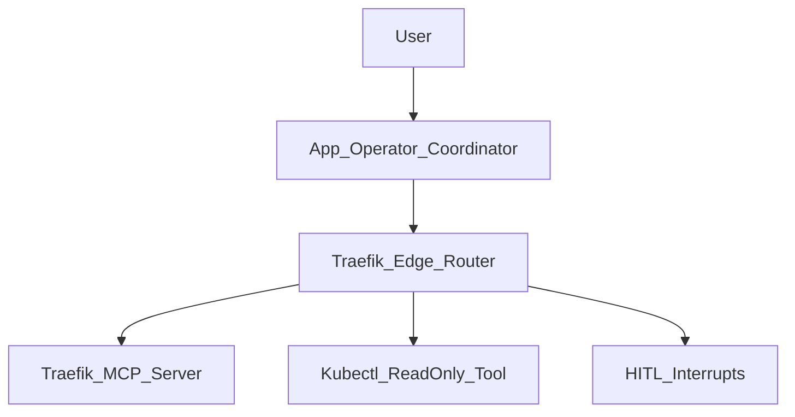

## Traefik Edge Routing Sub-Agent (K8s Autopilot)

This folder documents the **Traefik Edge Routing onboarding sub-agent** inside K8s Autopilot.
In plain terms, it’s a “guided edge routing autopilot” that helps you safely manage **weighted canary routing**, **middlewares**, **shadow launches**, and **NGINX migrations** by:

- **Understanding** what you want (split traffic, add rate limits, migrate from NGINX),
- **Checking prerequisites** (what routes exist, what is the current traffic distribution?),
- Showing you a **human-friendly plan preview** (complete with proposed YAML and traffic distributions),
- Then **executing** the steps using the Traefik MCP server—**with strict approval gates** for applying manifests and migrations.

If you are lightly technical: you can think of this as “a traffic engineering workflow engine + guardrails,” not a simple chatbot.

---

## What it can do (capabilities)

The sub-agent is organized around five major capability areas:

### 1. Edge Routing & Traffic Splitting
- **Weighted Routing**: Safely create and update weighted canary routes using a `TraefikService` (Weighted Round Robin) paired with an `IngressRoute`.
- **Simple Routes**: Establish direct `IngressRoute` connections to Kubernetes Services without weight splitting.
- **Advanced Matchers**: Scope traffic by URL path prefixes, headers, or regex cookies (e.g., routing users with `Cookie: canary=true` to a specific backend).

### 2. Middleware & Resiliency
- **Traffic Shaping**: Manage complex middlewares including rate limiting, circuit breakers, in-flight request limits, and buffering.
- **Security & Headers**: Manage IP allowlists/denylists, forward auth, strip prefix, and header modifications.
- **Dynamic Attachment**: Dynamically attach or detach these middlewares to live `IngressRoute` definitions without downtime.

### 3. Traffic Mirroring (Shadow Launches)
- Configure Traefik to mirror a percentage of production traffic to a new "canary" service silently. Users always receive responses from the stable service, allowing you to test the canary service under real-world load safely.

### 4. TCP Routing & Affinity
- **TCP Support**: Manage `IngressRouteTCP` for non-HTTP traffic like PostgreSQL, Redis, or MQTT, including TCP-specific middlewares like IP allowlists.
- **Sticky Sessions**: Easily annotate Kubernetes Services to enable sticky cookies for session affinity.
- **Backend Transport**: Manage `ServersTransport` CRDs to configure backend dial/response timeouts and backend TLS configurations.

### 5. NGINX Migration & Validation
- **Automated Translation**: Analyze existing `Ingress` objects managed by NGINX and translate them automatically into native Traefik `IngressRoute` and `Middleware` CRDs.
- **Breaking Annotation Detection**: Scans NGINX annotations and surfaces incompatible or breaking configs before the migration occurs.

### 6. Read-Only / Fast Path (Observability)
- View current traffic distribution on any given route in real-time.
- Fetch Prometheus metrics to confirm traffic volumes and error rates.
- View historical and active traffic anomalies automatically detected by the system.
- *Kubectl Diagnostics*: Safely inspect cluster state directly via the `kubectl_readonly` tool to debug failing pods or misconfigured Traefik endpoints.

---

## Tool Reference Guide (Internal Capabilities)

The sub-agent executes actions using specific tools bound to the MCP server. Here is a comprehensive list of its internal capabilities:

| Tool Name | Actions | Purpose |
|-----------|---------|---------|
| `traefik_manage_weighted_routing` | `create`, `update`, `delete` | Weighted canary routes — creates TraefikService (WRR) + IngressRoute pair. |
| `traefik_manage_simple_route` | `create` (upsert), `delete` | Direct IngressRoute to a K8s Service, no weight splitting. |
| `traefik_manage_middleware` | `create`, `update`, `delete` | Manages rate limits, circuit breakers, ip allowlists, buffering, etc. |
| `traefik_manage_route_middlewares` | `attach`, `detach` | Add/remove middlewares on a live IngressRoute. |
| `traefik_manage_traffic_mirroring` | `enable`, `update`, `disable` | Shadow-copy a % of production traffic to canary services. |
| `traefik_manage_servers_transport` | `create`, `delete` | ServersTransport CRD — backend dial/response timeouts, backend TLS config. |
| `traefik_configure_service_affinity` | `enable`, `disable` | Sticky-cookie annotations on K8s Services. |
| `traefik_manage_tcp_routing` | `create`, `delete` | IngressRouteTCP for PostgreSQL, Redis, MQTT. |
| `traefik_configure_tcp_middleware` | `create` | TCP IP allowlist MiddlewareTCP. |
| `traefik_nginx_migration` | `generate`, `apply`, `revert` | NGINX Ingress to Traefik CRD translation. |
| `traefik_generate_routing_manifest` | `manifest_type` flags | Generate Traefik YAML for GitOps review. |

---

## High-level architecture (layman + technical)

There is one **orchestrator** (the “brains”) and several **specialized sub-agents** (the “hands”).

- The orchestrator delegates traffic and routing workflows to:
  - **traefik-edge-router**: The specialized agent that understands Traefik CRDs and progressive shifting patterns.

All real operations are performed via the **Traefik MCP Server** and the `kubectl_readonly` utility tool. This means:
- The agent **does not guess** cluster state. It always looks at the live cluster.
- The agent **retrieves fresh data** before planning or executing any action.

**Traefik MCP server implementation reference**:
- [talkops-ai/talkops-mcp `src/traefik-mcp-server`](https://github.com/talkops-ai/talkops-mcp/tree/main/src/traefik-mcp-server)

Here is the flow at a glance:

---

## What “agentic” means here (vs a chatbot)

This sub-agent is “agentic” because it is designed to:

- **Plan before acting**: It presents a clear action plan to you, showing current vs proposed weights or showing generated YAML.
- **Validate prerequisites automatically**: It runs idempotency checks. Before it updates traffic weights, it calls `traefik://traffic/{ns}/{route}/distribution` to ensure the route exists and has valid targets.
- **Execute with guardrails**: It enforces `generate-before-apply`, showing you the generated Traefik YAML before touching the cluster.
- **Batch Processing**: It uses an `eval` tool to batch multi-step lookups programmatically when scanning massive clusters for routes, avoiding infinite loop timeouts.
- **Keep you in control**: It halts execution upon detecting breaking NGINX annotations and prompts you to confirm manual overrides.

---

## How a workflow runs (keeping you in the loop)

The orchestrator follows a simple “phased” workflow (documented in its system prompt and `SKILL.md` file):

1) **Explore / Understand the request**
   - Identify the current state using MCP resources.
   - Check the operations journal (`operations-log.md`) for recent context.

2) **Validate prerequisites**
   - Read current route configurations.
   - Example: Before shifting canary weights, it confirms both the stable and canary Kubernetes services have active endpoints.

3) **Plan preview**
   - Show a human-friendly plan preview (e.g., "Shift traffic from 90/10 to 80/20").
   - The agent **pauses** and asks you to approve/reject the plan.

4) **Execute with checkpoints**
   - Runs concrete tool calls via MCP.
   - First call for migrations or manifests uses `action=generate` to show you the YAML. Upon confirmation, a second call uses `action=apply`.
   - High-impact tool-level approvals kick in for migrations and route deletions.

5) **Continuous validation**
   - After updating traffic weights, it reads metrics and active anomaly reports to ensure error rates remain completely stable.

### Where the agent will pause (HITL)

There are three types of “pauses”:

- **Plan review pause**: A single “Approve this plan?” step before any execution begins.
- **Missing required inputs pause**: To gather missing parameters without halting the entire agent process.
- **Tool-level approval pause**: High-impact operations trigger `HumanInTheLoopMiddleware`.

---

## Middleware components (what they do, in plain English)

Middleware guarantees reliability and prevents hallucinations by strictly controlling state.

### `AppOperationContextMiddleware` (state + audit trail)
What it does:
- Injects a context journal of recent operations into the prompt to survive summarization.
Why it matters:
- The agent remembers previous routing updates seamlessly across long conversational sessions.

### `PlanLockMiddleware` (enforces plan fidelity)
What it does:
- Once a plan is approved, it locks the LLM into executing exactly those steps, preventing drift or "creative" deviations.

### `HumanInTheLoopMiddleware` (tool-level approvals)
What it does:
- Wraps high-impact operations with an explicit interactive approval card.
- For Traefik, this involves intercepting tool calls like:
  - `traefik_manage_weighted_routing` and `traefik_manage_simple_route`
  - `traefik_manage_middleware` and `traefik_manage_traffic_mirroring`
  - `traefik_manage_tcp_routing` and `traefik_nginx_migration`
- Provides **elevated visual warnings (`🚨 PRODUCTION`)** if targeting namespaces like `prod`, `production`, `live`, or `prd`.

Why it matters:
- Traefik operations directly affect live, edge routing. An accidental 0/0 split or misconfigured rate-limit affects users immediately. Approval gates protect against catastrophic user-facing outages.

---

## How an NGINX Migration typically looks (example)

Example user request:
- “Migrate the frontend-ingress from NGINX to Traefik.”

Typical flow:
- The agent calls `traefik://migration/nginx-ingress-analyze` to scan the current NGINX annotations on the `frontend-ingress`.
- It notices a breaking annotation (`nginx.ingress.kubernetes.io/rewrite-target`) that requires manual adjustment.
- It presents a compatibility table to you (supported / unsupported / breaking).
- Once you acknowledge the plan, it runs `traefik_nginx_migration(action="generate")`.
- It displays the native Traefik `IngressRoute` and `Middleware` YAML for your review.
- Upon approval, it runs `traefik_nginx_migration(action="apply")`. The HITL middleware catches it, asks for final cluster confirmation, and then commits the changes.

---

## Safety and UX principles (what we enforce)

- **Generate before apply**: For migrations and complex manifests, YAML is generated and presented before applying.
- **Read distribution before updating weights**: The agent always verifies the current routing state to prevent unintended weight-zeroing.
- **No 0/0 weight states**: The agent is explicitly instructed never to set both stable and canary weights to 0, which would make the route entirely unreachable.
- **Monitor after weight shifts**: The agent actively checks Prometheus metrics and anomaly endpoints to ensure error rates are stable post-shift.
- **TCP routes have no rollback**: TCP `IngressRouteTCP` objects lack weight-based splitting. The agent emphasizes strict confirmation before TCP route creation, warning users of the lack of automated rollback.
- **Cross-domain coordination**: If a service is managed by Argo Rollouts, the agent knows not to use Traefik's Weighted Round Robin simultaneously to avoid confusing, conflicting traffic distributions.

---

## Gotchas and Edge Cases

Because edge routing is unforgiving, the agent handles several known Traefik-specific "gotchas" via its `SKILL.md`:

- **Rate limit average is per-second**: If a user says "100 requests per minute", the agent sets `average: 100, period: "60s"`. It knows the default period is 1 second and actively prevents naive misconfigurations.
- **Missing `sourceCriterion`**: When creating rate limits, it always includes a `sourceCriterion` (like `ipStrategy`). Without it, the rate limit applies globally across all clients, allowing one heavy user to exhaust the budget for everyone.
- **Middleware Namespaces**: IngressRoute annotations reference middleware as `name@kubernetescrd`. The agent knows that omitting the `@kubernetescrd` suffix causes silent 404 errors, so it always appends it.
- **ACME Interception**: In Traefik v3, TLS passthrough routers may have ACME challenges intercepted. The agent checks logs for "Cannot retrieve the ACME challenge" and advises `allowACMEByPass: true` when necessary.
- **Empty Backend 503s**: Traefik doesn't skip empty backends in weighted round-robin. The agent verifies that the canary service has at least 1 ready pod before shifting any traffic to it.
