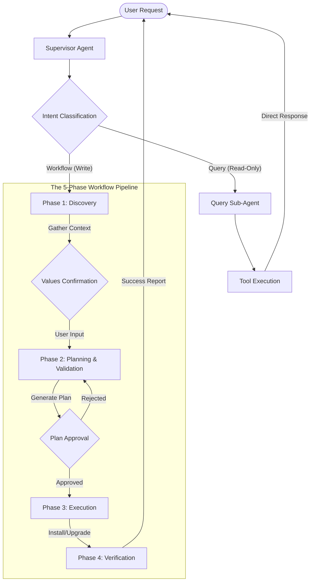

# Helm Management Deep Agent - Comprehensive Architecture

> **Single Source of Truth** for the Helm Management Agent's design, architecture, and implementation.

---

## 1. Executive Summary

The **Helm Management Agent** is a specialized autonomous system for managing Kubernetes applications via Helm. It is designed to solve the "Safety vs. Speed" trade-off by implementing a **Dual-Path Architecture**:

1.  **Query Path (Fast-Track)**: Low-latency, direct responses for read-only operations (status, listing, search). bypassing heavy planning/approval loops.
2.  **Workflow Path (Safe-Track)**: A rigorous 5-phase pipeline for state-changing operations (install, upgrade, rollback), strictly enforcing Human-In-The-Loop (HITL) safety gates.

**Core Capabilities**:
*   Automated Chart Discovery & Validation
*   Context-Aware Upgrades (diffing current vs new values)
*   Interactive Planning with User Approval
*   Robust Error Recovery & State Management

---

## 2. Dual-Path Architecture

The agent acts as a router first, determining the "Risk Profile" of a user request before execution.

### 2.1 The Classifier Node
The Supervisor (`HELM_MGMT_SUPERVISOR_PROMPT`) analyzes the request to route based on intent:

| Path Type | Trigger Keywords | Target Agent | Characteristics |
| :--- | :--- | :--- | :--- |
| **Query Path** | `show`, `list`, `get`, `status`, `describe`, `search`, `check` | **Query Agent** | Immediate response. No approvals. Read-only tools. |
| **Workflow Path** | `install`, `upgrade`, `update`, `delete`, `uninstall`, `rollback`, `deploy` | **Discovery Agent** | Stateful. Multi-step. Required HITL. High safety. |

---

## 3. The Workflow Path (Detailed)

This path manages complex state changes. It is strictly linear and phase-gated.

### 🟢 Phase 1: Discovery & Context
**Objective**: Understand *what* to do and gather necessary files.
*   **Logic**:
    *   **Scenario Detection**: Checks if release exists using `helm_get_release_status`.
        *   *Exists?* -> **UPGRADE** Mode.
        *   *Missing?* -> **INSTALL** Mode.
    *   **Data Gathering**: Fetches `Chart.yaml`, `values.yaml`, and `values.schema.json`.
*   **Transition**: Automatically moves to Phase 2.

### 🟡 Phase 2: Values Confirmation (HITL Gate #1)
**Objective**: ensure the agent has the *correct configuration* before wasting tokens on planning.
*   **Interaction**:
    *   **Upgrade**: Shows "Current Values" vs "Proposed Changes".
    *   **Install**: Shows "Required Fields" (from Schema) vs "Defaults".
*   **Strict Rule**: The agent *must* stop and wait for user confirmation (`request_human_input`).
*   **Anti-Loop**: Once the user responds, the agent *immediately* transitions to Phase 3.

### 🟠 Phase 3: Planning & Validation
**Objective**: purely computational validation (no side effects).
*   **Actions**:
    1.  **Schema Validation**: Runs `helm_validate_values` against the official JSON Schema.
    2.  **Prerequisite Check**: `kubernetes_check_prerequisites` (e.g., K8s version, available nodes).
    3.  **Plan Generation**: `helm_get_installation_plan` creates a detailed manifesto (resources, diffs, rollback steps).
*   **Outcome**: A "Ready-to-Execute" plan or a list of validation errors.

### 🔴 Phase 4: Approval (HITL Gate #2)
**Objective**: The "Nuclear Button" check.
*   **Interaction**: Use `request_human_input` to present the generated plan.
*   **Options**:
    *   `Approve` -> Proceed to Execution.
    *   `Reject` -> Abort workflow.
    *   `Modify` -> Return to Phase 3 (Planning) with new values.

### 🟢 Phase 5: Execution & Verification
**Objective**: Make it happen and verify it worked.
*   **Actions**:
    *   **Execute**: Calls `helm_install_chart` or `helm_upgrade_release`.
    *   **Verify**: Immediately polls `helm_get_release_status` and `helm_monitor_deployment` to check Pod health.
*   **Completion**: Updates state to `COMPLETED` and informs user.

---

## 4. Architecture & Middleware components

A robust agent systems requires more than just prompts. We use specialized middleware classes to handle technical concerns.

### 4.1 `HelmAgentStateMiddleware`
*   **Purpose**: Keeps the internal `HelmAgentState` in sync with tool outputs.
*   **Function**: Intercepts tool return values (e.g., from `helm_get_chart_info`) and automatically populates the `chart_metadata` state field.
*   **Optimization**: Prevents duplicate tool calls. If `chart_metadata` is already populated, it intercepts subsequent discovery calls and returns the cached data, saving latency and tokens.

### 4.2 `HelmApprovalHITLMiddleware`
*   **Purpose**: The "Safety Net".
*   **Function**: Even if the LLM "hallucinates" and tries to skip the Approval Phase, this middleware intercepts high-concept tools (`install`, `upgrade`, `delete`).
*   **Mechanism**: It raises a `pending_tool_calls` interrupt, forcing the system to pause and wait for a human "Approve" signal before the tool is actually invoked.

### 4.3 `ErrorRecoveryMiddleware`
*   **Purpose**: Resilience against flaky infrastructure.
*   **Function**: Wraps read-only tools (`helm_search_charts`, `kubernetes_get_cluster_info`) in a retry loop (up to 3 attempts with exponential backoff) to handle transient network issues.

---

## 5. State Management Schema

The agent maintains a persistent state object `HelmAgentState` across the conversation.

| Field | Type | Description |
| :--- | :--- | :--- |
| `scenario_type` | `str` | `INSTALL`, `UPGRADE`, `ROLLBACK`, or `UNINSTALL`. Determines the workflow logic. |
| `chart_metadata` | `dict` | Verified details of the target chart (Version, Repo, URL). |
| `user_provided_values`| `dict` | Configuration values explicitly confirmed by the user. |
| `current_release` | `dict` | (Upgrade Only) Snapshot of the running release *before* changes. |
| `validation_results` | `dict` | Output of schema validation checks. |
| `execution_plan` | `dict` | The approved plan (steps, resources, risks). |
| `phase_history` | `list` | Trace of completed workflow phases (e.g., `['discovery', 'values_confirmation']`). |

---

## 6. Implementation Reference

### Key Files
*   **Supervisor Definition**: `k8s_autopilot/core/agents/helm_mgmt/helm_mgmt_agent.py`
    *   Class: `k8sAutopilotHelmMgmtAgent`
    *   Contains: Middleware setup, Tool Registry, Sub-agent graph construction.
*   **Prompts**: `k8s_autopilot/core/agents/helm_mgmt/helm_mgmt_prompts.py`
    *   `HELM_MGMT_SUPERVISOR_PROMPT`: The master prompt enforcing phases.
    *   `DISCOVERY_SUBAGENT_PROMPT`: Specialized for context gathering.
    *   `PLANNER_SUBAGENT_PROMPT`: Specialized for validation logic.

### Tool Registry
All tools are provided via the **Helm MCP Server**.

*   **Discovery**: `helm_search_charts`, `helm_get_chart_info`, `helm_list_chart_versions`, `read_mcp_resource`.
*   **Cluster**: `kubernetes_get_cluster_info`, `kubernetes_list_namespaces`.
*   **Management**: `helm_get_release_status`, `helm_install_chart`, `helm_upgrade_release`, `helm_rollback_release`, `helm_uninstall_release`.
