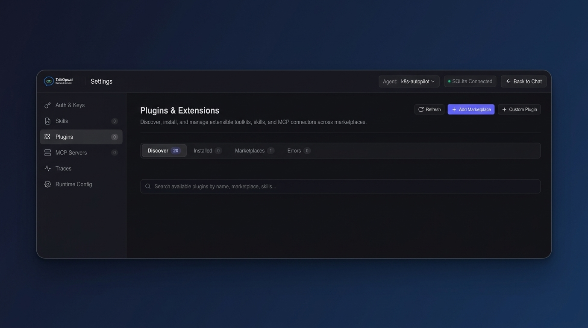
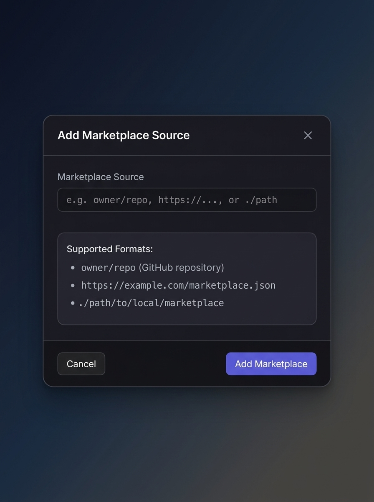
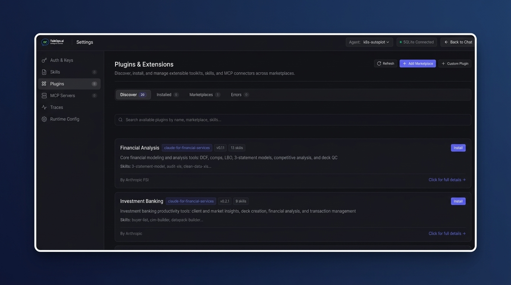

# Plugins and marketplaces

> Extend k8s-autopilot with plugins that add new skills, sub-agents, MCP servers, and commands

Plugins let you add new capabilities to k8s-autopilot without modifying the core agent. Think of them as add-ons — each plugin brings a focused set of skills, tools, or even a dedicated sub-agent that the main agent can call on when needed.

There are two types of plugins, and k8s-autopilot detects the type automatically based on what the plugin contains:

| Type | What it adds | How it works |
|---|---|---|
| **Agent plugin** | A dedicated sub-agent with its own skills, MCP servers, and tool scope | The sub-agent runs in isolation — its tools don't mix with the main agent's tools |
| **Vertical plugin** | Skills and commands that extend the main agent directly | Skills bind directly to the main agent, giving it new capabilities |

If the plugin has an `agents/` directory, it's treated as an agent plugin. Otherwise, its skills and commands bind directly to the main agent.

> [!WARNING]
> Only install plugins from sources you trust. An enabled plugin can add instructions, start MCP server processes, and register tools with your user permissions.

## Install a plugin from the UI

The easiest way to add plugins is through the Settings UI. Here's how:

### Step 1 — Open the Plugins panel

Go to **Settings → Plugins** to see the Plugins & Extensions page. This is where you discover, install, and manage all your plugins.



The panel has four tabs:

| Tab | What it shows |
|---|---|
| **Discover** | Available plugins from all connected marketplaces |
| **Installed** | Plugins you've already installed (with enable/disable/uninstall controls) |
| **Marketplaces** | Your connected marketplace sources |
| **Errors** | Any plugins that failed to load, with error details |

### Step 2 — Add a marketplace

Before you can discover plugins, you need to connect at least one marketplace. Click the **+ Add Marketplace** button and enter a marketplace source.



Supported marketplace formats:

- **GitHub repository** — `owner/repo` format (e.g., `anthropic/claude-for-financial-services`)
- **HTTPS URL** — A URL pointing to a `marketplace.json` file
- **Local path** — A local directory containing a marketplace catalog

Click **Add Marketplace** to save. k8s-autopilot clones or downloads the marketplace catalog and indexes all available plugins.

### Step 3 — Discover and install plugins

Once a marketplace is connected, switch to the **Discover** tab. You'll see all available plugins with their descriptions, skill counts, and version info.



Each plugin card shows:

- **Plugin name** and marketplace source
- **Version** and number of skills included
- **Description** of what the plugin does
- **Skills list** — the individual capabilities the plugin brings
- **Author** — who built the plugin

Click **Install** on any plugin you want. Once installed, the plugin's skills and tools are immediately available to the agent — no restart needed. If it's an **agent plugin**, a new sub-agent is registered and the main agent can delegate tasks to it. If it's a **vertical plugin**, its skills are added directly to the main agent's context.

You can also click **+ Custom Plugin** to add a plugin from a local directory or Git repository that isn't part of any marketplace.

### Managing installed plugins

From the **Installed** tab, you can:

- **Enable/disable** a plugin — Disabled plugins stay installed but their skills and tools are excluded from the agent
- **Uninstall** a plugin — Removes it completely
- **View details** — See all skills, MCP servers, and commands the plugin provides

## Plugin types explained

### Agent plugins

An agent plugin creates a **dedicated sub-agent** that runs independently from the main agent. The sub-agent has its own skills, its own MCP servers, and its own tool scope. The main agent can delegate tasks to it, but the sub-agent can't access the main agent's tools, and vice versa.

This is useful when you want a plugin to operate as a specialist — for example, a Terraform linting agent that only has access to file reading tools and Terraform-specific skills.

**Example structure:**

```
terraform-linter/
├── plugin.json                 # Plugin metadata
├── agents/                     # Makes it an agent plugin
│   └── terraform-linter/
│       └── AGENTS.md           # Sub-agent system prompt
└── skills/
    ├── tf-fmt-check/
    │   └── SKILL.md
    └── tf-validate/
        └── SKILL.md
```

When installed, the sub-agent is registered with the main agent. When you ask something like "lint my Terraform module", the main agent recognizes the request and delegates it to the Terraform linter sub-agent.

### Vertical plugins

A vertical plugin adds skills and commands directly to the main agent — no sub-agent involved. Use vertical plugins for cross-cutting capabilities that should be available everywhere, like security scanning, cost estimation, or compliance checks.

**Example structure:**

```
security-scanner/
├── plugin.json                 # Plugin metadata
├── skills/
│   ├── vuln-scan/
│   │   └── SKILL.md
│   └── compliance-check/
│       └── SKILL.md
└── .mcp.json                   # Optional MCP server
```

When installed, the skills (`vuln-scan`, `compliance-check`) become part of the main agent's skillset. The agent can use them in any conversation.

## Plugin structure

A plugin is a directory with a manifest file and optional subdirectories:

```
my-plugin/
├── plugin.json              # Required — metadata and version
├── skills/                  # Optional — domain skills
│   └── my-skill/
│       └── SKILL.md
├── agents/                  # Optional — sub-agent definitions (makes it an agent plugin)
│   └── my-agent/
│       └── AGENTS.md
├── .mcp.json                # Optional — bundled MCP server configuration
├── commands/                # Optional — custom slash commands
│   └── my-command.md
└── resources/               # Optional — templates, scripts, and assets
```

### plugin.json

Every plugin needs a `plugin.json` manifest:

```json
{
  "name": "my-plugin",
  "version": "1.0.0",
  "description": "What this plugin does — shown in the UI",
  "author": {
    "name": "Your Name"
  }
}
```

k8s-autopilot also supports manifests in `.claude-plugin/plugin.json` or `.opscode-plugin/plugin.json` for cross-platform compatibility.

### Bundled MCP servers

Plugins can include a `.mcp.json` file to bundle their own MCP servers. These servers are started automatically when the plugin is enabled.

```json
{
  "mcpServers": {
    "my-cost-api": {
      "command": "${PLUGIN_ROOT}/scripts/start-server",
      "env": {
        "API_KEY": "${MY_API_KEY}"
      }
    }
  }
}
```

Plugin MCP configs support **variable substitution** — k8s-autopilot automatically resolves these variables at startup:

| Variable | What it resolves to |
|---|---|
| `${PLUGIN_ROOT}` | The plugin's installation directory |
| `${PLUGIN_DATA}` | The plugin's persistent data directory |
| `${PROJECT_DIR}` | The current project directory |
| `${ENV_VAR}` | Any environment variable |

## Marketplaces

A marketplace is a curated collection of plugins. It can be a GitHub repository, a URL, or a local directory — as long as it contains a `marketplace.json` catalog.

### marketplace.json format

```json
{
  "name": "company-devops-plugins",
  "description": "Internal DevOps plugins for our team",
  "plugins": [
    {
      "name": "kubernetes-sre",
      "displayName": "Kubernetes SRE",
      "description": "SRE incident diagnostics and runbooks",
      "source": "./plugins/kubernetes-sre"
    },
    {
      "name": "cost-analyzer",
      "displayName": "Cost Analyzer",
      "description": "Cloud cost analysis and optimization recommendations",
      "source": "./plugins/cost-analyzer"
    }
  ]
}
```

### Create your own marketplace

To share plugins with your team:

1. Create a Git repository with a `marketplace.json` at the root
2. Place each plugin in its own subdirectory
3. Reference plugin directories using relative paths in `source`
4. Share the repository URL with your team

Your team members can then add it from the Settings UI by clicking **+ Add Marketplace** and entering your repository URL (e.g., `my-org/devops-plugins` or `https://github.com/my-org/devops-plugins`).

### Local marketplace

You can also bundle a marketplace inside your project so plugins travel with your codebase:

```
.k8s-autopilot/plugins/marketplace.json
```

This makes the entire plugin ecosystem Git-trackable and team-shareable. Plugins in a local marketplace are automatically discovered on startup.

## Where plugins are stored

| Location | What's stored there |
|---|---|
| `~/.k8s-autopilot/plugins/` | User-installed plugins from marketplaces |
| `~/.k8s-autopilot/plugins/marketplaces/` | Cloned marketplace repositories |
| `.k8s-autopilot/plugins/` (project root) | Project-level plugins shared with the team via Git |
| Database (Settings UI) | Plugin enablement state and marketplace records |

## Next steps

- **[MCP Servers](./mcp-servers.md)** — How plugins can bundle their own MCP servers
- **[Operators and Sub-agents](./operators-and-subagents.md)** — How plugin sub-agents integrate with the agent hierarchy
- **[Configuration](./configuration.md)** — Runtime settings and environment variables
