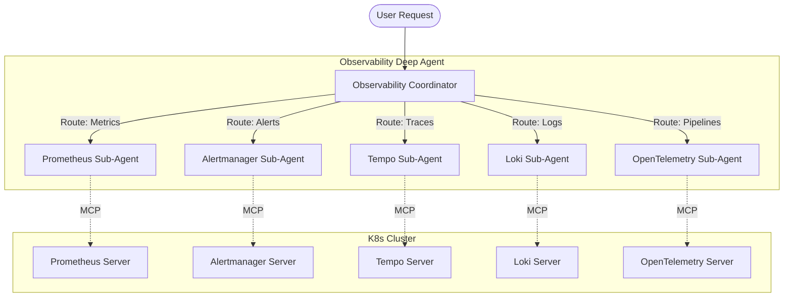

# k8s-autopilot Observability Deep Agent

> [!NOTE]
> This documentation covers the **Observability Coordinator** and its architecture. For specific sub-agent documentation, please refer to the individual component directories.

The **Observability Deep Agent** is a multi-agent hierarchy within `k8s-autopilot` designed to orchestrate complex monitoring, alerting, tracing, and logging workflows across Kubernetes clusters. 

Instead of relying on a single monolithic LLM context, the Observability Agent delegates domain-specific tasks to specialized **sub-agents**. Each sub-agent is backed by a dedicated Model Context Protocol (MCP) server, localized skills, and strict Human-in-the-Loop (HITL) safety middleware.

---

## 🏗️ Architecture Overview

The system follows a Coordinator-Subagent architecture built on LangGraph.

### The Blackboard Pattern & Context Engineering

The Coordinator acts as a routing engine and memory manager. It utilizes "Context Engineering" to ensure sub-agents receive exactly the context they need without overflowing the LLM window:

1. **Investigation Context**: If a user request contains SRE investigation fields (e.g., `service_name`, `environment`, `incident_id`), the Coordinator automatically injects these into the base context of every sub-agent. Sub-agents use this to auto-filter queries.
2. **Operations Journal**: A living journal (`operations-log.md`) is maintained throughout the session. The `ObsOperationContextMiddleware` automatically injects this context before every model call, ensuring the agent never "forgets" what it just did, even across conversation boundaries or LangGraph summarizations.
3. **Cross-Domain Blackboard**: If the Observability agent finishes a task (e.g., finding a trace), it produces a distilled `domain_summary`. The parent Supervisor accumulates these summaries on a "blackboard" and passes them to downstream agents (e.g., App Operator) to prevent repetitive data gathering.

---

## 🛡️ Middleware & Safety Nets

The Observability deep agent implements a robust middleware stack to protect both the cluster and the LLM context limit:

### 1. Operations Context Injection (`ObsOperationContextMiddleware`)
Survives standard LangGraph message summarization by actively prepending the recent operations log as a `SystemMessage` just-in-time before the LLM call.

### 2. A2UI Buffer Interceptor (`A2UIBufferMiddleware`)
**Critical for Context Limits.** Deep observability queries often return megabytes of JSON data (Trace DAGs, raw log streams, time-series matrices) that would instantly exhaust the LLM's context window. This middleware acts as a safety valve for **Dynamic UI Rendering**.

When a sub-agent executes one of the specialized A2UI tools:
- **Prometheus**: `prom_query_a2ui_chart` (Interactive Metric Charts)
- **Loki**: `loki_query_a2ui` (Interactive Log Tables)
- **Tempo**: `tempo_query_a2ui` (DAG Trace Timelines)
- **OpenTelemetry**: `otel_query_a2ui` (Pipeline Visualizations)
- **Alertmanager**: `am_query_a2ui` (Alert Dashboards)

The middleware intercepts the massive JSON response from the MCP server, writes it directly into the LangChain tool artifact store, and replaces the LLM's text view with a tiny pointer string: 
`"Data successfully fetched and buffered in tool artifact. Now call build_obs_a2ui..."`

The sub-agent then calls the shared `build_obs_a2ui` tool, which pipes the buffered data to the frontend, generating a rich, interactive React visualization for the user without ever bloating the AI context.

### 3. Human-in-the-Loop (HITL) Gateways
Every state-modifying action (e.g., installing an exporter, patching a collector, expiring a silence) is gated by `HumanInTheLoopMiddleware`. This enforces a strict **Generate-Before-Apply** constraint.
- The sub-agent MUST formulate a plan.
- The user reviews the plan.
- Only upon approval does the middleware allow the MCP mutation tool to execute.

### 4. Code Interpreter Middleware (PTC Allowlist)
Instead of forcing the LLM to make 50 sequential tool calls to check the status of 50 services, sub-agents are equipped with read-only Python Tool Calling (PTC). A localized code interpreter allows the sub-agent to write a quick loop, execute the read-only MCP queries programmatically, and summarize the results in a single LangGraph step.

---

## 📖 Sub-Agent Documentation Directory

For deep dives into the capabilities, skill rules, workflow examples, and tool references of each sub-agent, see their dedicated documentation:

* [**Prometheus Operator**](./prometheus/README.md) - Metrics, Exporters, ServiceMonitors, Rule Groups.
* [**OpenTelemetry Operator**](./opentelemetry/README.md) - Collector Provisioning, Auto-Instrumentation, Sampling.
* [**Loki Operator**](./loki/README.md) - LogQL, Pattern Discovery, Trace-Log Correlation.
* [**Alertmanager Operator**](./alertmanager/README.md) - Silence Lifecycle, Test Alerts, Routing Audit.
* [**Tempo Operator**](./tempo/README.md) - TraceQL, Critical Paths, RED Metrics, DAG Topology.
