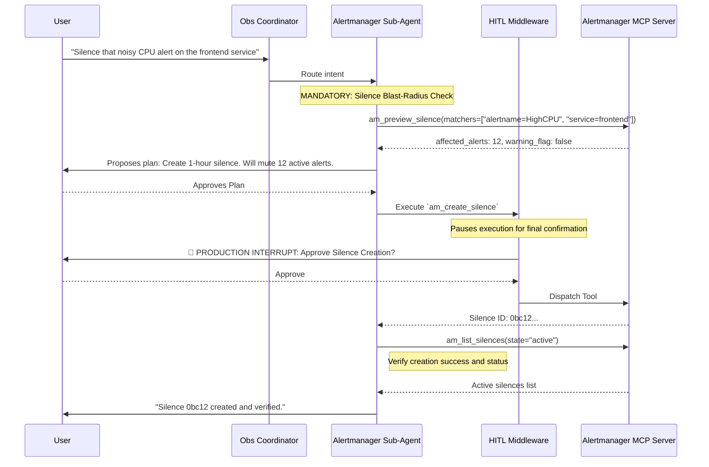

# Alertmanager Sub-Agent (Observability Deep Agent)

> [!NOTE]
> This agent specializes in Alertmanager operations. For metrics, scraping, and alerting *rules* creation, refer to the [Prometheus Sub-Agent](../prometheus/README.md).

The **Alertmanager Operator** handles the alerting lifecycle. It connects to the `alertmanager-mcp-server` to assist users with on-call triage, routing configuration audits, integration testing, and the strict, heavily-guarded management of alert silences.

---

## 🏗️ Architecture & Interaction Flow

---

## 🛠️ Tool Capabilities Reference

The Alertmanager sub-agent possesses tools segmented into Discovery and State-Modifying. Silence operations are heavily guarded due to their potential to mask critical production outages.

### Read-Only Discovery Tools
*Used for triage and auditing. Do not trigger HITL interrupts.*

| Tool Name | Capability | Typical Usage |
|-----------|------------|---------------|
| `am_list_alerts` | Active Alert Query | Fetching currently firing alerts for a specific service or severity. |
| `am_summarize_oncall` | Triage Summary | Requesting a top-level breakdown of the active alert landscape. |
| `am_query_a2ui` | Dynamic UI Rendering | Buffering alert payload lists into A2UI interactive alert dashboards. |
| `am_preview_silence` | Blast-Radius Preview | **Mandatory.** Checking how many firing alerts will be muted by a proposed matcher set. |
| `am_validate_silence_policy` | Governance Check | Ensuring a silence doesn't violate max-duration or required-label policies. |
| `am_explain_routing` | Routing Audit | Tracing an alert payload to see which receiver (Slack, PagerDuty) it will hit. |
| `am_list_silences` | Silence Audit | Checking active, pending, or expired silences. |
| `am_list_recent_changes` | Audit Log | Reviewing who created/deleted silences recently via `am://system/audit-log`. |

### State-Modifying Tools
*Gated by the `HumanInTheLoopMiddleware`. Execution requires explicit user approval.*

| Tool Name | Action | Required Parameters | Impact / Blast Radius |
|-----------|--------|---------------------|-----------------------|
| `am_create_silence` | Creates a new silence window. | `matchers`, `duration_minutes`, `created_by` | Suppresses notifications for matching alerts. |
| `am_update_silence` | Extends an existing silence. | `silence_id`, `add_minutes` / `new_ends_at` | Extends suppression window. |
| `am_expire_silence` | Prematurely ends a silence. | `silence_id` | **Reactivates notifications immediately.** |
| `am_push_test_alert` | Fires a synthetic alert. | `alert_labels`, `receiver` | **Triggers REAL downstream integrations (PagerDuty, Slack).** |
| `am_silence_alert` | Quick-silence helper. | `fingerprint` / `alert_labels`, `scope` | Auto-generates matchers based on scope (instance vs service). |

---

## 🔒 Safety Principles & Sub-Agent Constraints

Because improper Alertmanager operations can mask severe outages, this sub-agent adheres to strict, mandatory workflows defined in its `SKILL.md`:

1. **The Mandatory Silence Sequence**: The sub-agent is forbidden from directly calling `am_create_silence`. It MUST follow this sequence:
   - `am_preview_silence` (Checks blast radius and affected alert count).
   - `am_validate_silence_policy` (Checks compliance, e.g., Max Duration).
   - `request_human_input` (Present plan).
   - `am_create_silence` (Execute via HITL gate).
2. **Test Alerts Are Real**: The agent must warn the user that `am_push_test_alert` isn't a dry-run. It fires real webhooks to real PagerDuty/Slack channels.
3. **Never Blindly Suppress**: The agent is instructed not to silence `Critical` level alerts without first attempting to understand the root cause or prompting the user for justification.
4. **Agentic Defaults**: 
   - `duration_minutes` defaults to `60`.
   - `created_by` is NEVER defaulted; the agent must explicitly ask the user for their identifier if not provided.

---

## 🖥️ A2UI Dynamic Visualization

When users request to see alert data visually (e.g., "Show me an alert dashboard"), the agent uses the **A2UI Protocol**:

1. **Query**: The agent executes `am_query_a2ui(severity="critical")`.
2. **Buffer**: The massive JSON payload of alerts is intercepted by the `A2UIBufferMiddleware` to protect the LLM context.
3. **Render**: The agent reads the buffer pointer and calls `build_obs_a2ui`, generating a rich, interactive React alert dashboard in the frontend.

---

## 🚀 Concrete Workflow Examples

### Example 1: On-Call Triage

When an SRE logs in and says: *"What's on fire right now?"*

1. **Summarize**: The agent calls `am_summarize_oncall`.
2. **Analyze**: It groups alerts by severity (e.g., 2 Critical, 15 Warning).
3. **Deep Dive**: It follows up automatically with `am_list_alerts(severity="critical")` to pull the specific payloads for the highest-priority issues.
4. **Report**: Formats the findings into a clean Markdown table with root cause hints based on alert annotations.

### Example 2: Maintenance Window Silence

When a user says: *"We are patching the database cluster. Silence its alerts for 2 hours."*

1. **Preview Blast Radius**: The agent runs `am_preview_silence(matchers=["service=database-cluster"])`. It detects this will mute 45 current and potential alerts.
2. **Policy Check**: It validates a 120-minute duration against the `AM_MAX_SILENCE_MINUTES` policy.
3. **Approval**: It asks the user: *"This will mute 45 alerts for 2 hours. Who should I list as the creator?"*
4. **Execution**: After getting a name, it hits the HITL gate to execute `am_create_silence`.
5. **Verification**: Once created, it immediately calls `am_list_silences` to ensure the silence is active, and reminds the user to expire it early if maintenance finishes early.
