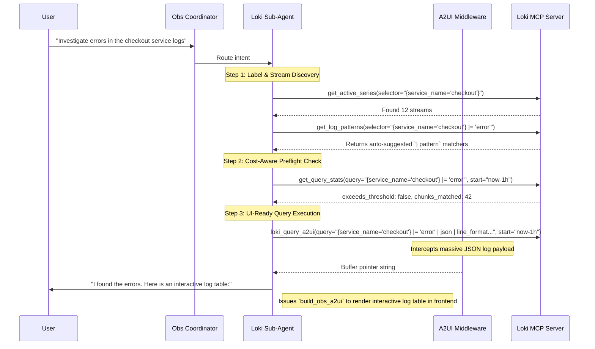

# Loki Sub-Agent (Observability Deep Agent)

> [!NOTE]
> This agent focuses exclusively on LogQL exploration, trace-log correlation, and log pipeline investigations. It is a **100% Read-Only** agent.

The **Loki Operator** connects to the `loki-mcp-server`. It empowers `k8s-autopilot` to navigate complex label taxonomies, automatically parse unstructured logs via LogQL patterns, run cost-preflight checks to protect the backend, and drive interactive UI dashboards via the A2UI protocol.

---

## 🏗️ Architecture & Interaction Flow

---

## 🛠️ Tool Capabilities Reference

The Loki sub-agent uses a highly sequential discovery pipeline. Because it has no state-modifying tools, it bypasses the `HumanInTheLoopMiddleware` entirely.

### Read-Only Discovery Tools
*Used to explore the log schema before executing heavy queries.*

| Tool Name | Capability | Typical Usage |
|-----------|------------|---------------|
| `get_cluster_labels` | Schema Discovery | Finding available label keys in the Loki cluster. |
| `get_label_values` | Schema Discovery | Finding valid values for a specific label (e.g., all `service_name`s). |
| `get_active_series` | Cardinality Check | Validating a selector matches real streams before querying. |
| `get_detected_fields`| Structure Analysis | Discovering hidden JSON or logfmt keys inside raw log lines. |
| `get_log_patterns` | Auto-Parsing | Getting auto-suggested `| pattern` strings for unstructured text logs. |
| `get_query_stats` | FinOps Preflight | **Mandatory.** Checking data volume of a query before execution. |

### Query Execution Tools
*Used to retrieve actual log lines or metric aggregations.*

| Tool Name | Action | Result Format |
|-----------|--------|---------------|
| `execute_logql_query` | Executes range queries over time. | Raw Markdown tables / JSON text. |
| `execute_logql_instant` | Point-in-time scalar queries. | Single integer/float values (e.g., error count). |
| `loki_query_a2ui` | Fetches logs for frontend UI rendering. | **A2UI Buffer Pointer.** Requires `| line_format`. |

---

## 🔒 Safety Principles & Sub-Agent Constraints

While read-only, Loki queries can easily topple a cluster via Out-Of-Memory (OOM) errors. The `SKILL.md` strictly enforces FinOps constraints:

1. **Mandatory Cost Preflight**: The agent must NEVER execute an `execute_logql_query` or `loki_query_a2ui` without first testing the query through `get_query_stats`. If `exceeds_threshold=true`, the agent must automatically narrow the time window or add stricter selectors.
2. **Discovery-First Rule**: The agent is forbidden from guessing label names or field paths. It must incrementally explore via `get_cluster_labels` -> `get_active_series` -> `get_detected_fields` to build accurate LogQL.
3. **Structured Metadata Scope**: The agent understands that `trace_id` and `span_id` are often stored as structured metadata. It knows they CANNOT be used inside the stream selector `{trace_id="..."}`. It must place them after the pipe: `{job="app"} | trace_id="..."`.
4. **A2UI Formatting Strictness**: When calling `loki_query_a2ui`, the agent MUST append parsing filters (e.g., `| json`) and a `| line_format` string so the frontend UI can cleanly render columns instead of a messy raw access log blob.

---

## 🖥️ A2UI Dynamic Visualization

When users request to see logs in a clean table (e.g., "Show me the error logs in a table"), the agent uses the **A2UI Protocol**:

1. **Query**: The agent executes `loki_query_a2ui(query="{app='cart'} | json | line_format...", start="...")`.
2. **Buffer**: The massive JSON payload of parsed log objects is intercepted by the `A2UIBufferMiddleware` to protect the LLM context.
3. **Render**: The agent reads the buffer pointer and calls `build_obs_a2ui`, generating a rich, interactive React log table in the frontend with sortable columns based on the `line_format` tokens.

---

## 🚀 Concrete Workflow Examples

### Example 1: Interactive Error Investigation

When a user says: *"Why is the cart service failing right now?"*

1. **Verify Stream**: The agent checks `get_active_series(selector="{service_name='cart'}")`.
2. **Find Structure**: It checks `get_detected_fields` and sees the logs are JSON with `level` and `message` keys.
3. **Preflight**: It checks `get_query_stats(query="{service_name='cart'} | json | level='error'")`.
4. **Render UI**: It executes `loki_query_a2ui(query="{service_name='cart'} | json | level='error' | line_format '{{.message}}'")`.
5. **A2UI Rendering**: The UI displays a clean, interactive data table of errors for the user to sort and filter.

### Example 2: Cross-Pillar Trace Correlation

When a user says: *"I see trace ID `1234abcd`, get me the logs for it."*

1. **Identify Strategy**: The agent knows `trace_id` is structured metadata.
2. **Construct Query**: It builds the query `{k8s_namespace_name="production"} | trace_id="1234abcd"`.
3. **Execute & Correlate**: It retrieves the logs and extracts any error messages, effectively bridging the gap between Tempo and Loki autonomously.
