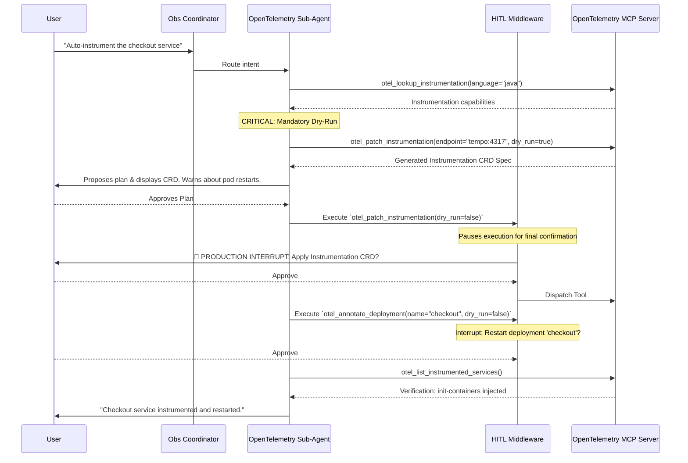

# OpenTelemetry Sub-Agent (Observability Deep Agent)

> [!NOTE]
> This agent manages OpenTelemetry pipelines, the OpenTelemetry Operator, and instrumentation CRDs. For pure metric querying or log parsing, refer to the [Prometheus](../prometheus/README.md) or [Loki](../loki/README.md) sub-agents.

The **OpenTelemetry Operator** connects to the `opentelemetry-mcp-server`. It empowers `k8s-autopilot` to safely deploy OTel collectors, inject auto-instrumentation into workloads, audit pipeline cardinality via SpanMetrics, toggle tail-sampling strategies, and analyze eBPF footprints.

---

## 🏗️ Architecture & Interaction Flow

---

## 🛠️ Tool Capabilities Reference

The OpenTelemetry sub-agent distinguishes strongly between read-only pipeline audits and modifying operations that cause cluster shifts or pod restarts.

### Read-Only Discovery Tools
*Used for auditing and pipeline validation. Do not trigger HITL interrupts.*

| Tool Name | Capability | Typical Usage |
|-----------|------------|---------------|
| `otel_list_collectors` | Discovery | Finding existing OTel collectors and their mode (DaemonSet, Deployment). |
| `otel_get_collector` | Pipeline Audit | Retrieving the raw YAML config of a collector to inspect processors/exporters. |
| `otel_list_instrumented_services`| Validation | Confirming if auto-instrumentation init-containers successfully injected into pods. |
| `otel_query_a2ui` | Dynamic UI Rendering | Buffering pipeline configurations into interactive A2UI visual DAGs. |
| `otel_validate_k8sattributes_order`| Safety Check | Ensuring `k8sattributes` processor runs *after* `batch` processor. |
| `otel_detect_cardinality` | FinOps | Identifying high-cardinality attributes inflating SpanMetrics data. |
| `otel_analyze_ebpf_footprint` | Security | Auditing RBAC and security contexts for eBPF-based instrumentation. |

### State-Modifying Tools
*Gated by the `HumanInTheLoopMiddleware`. Tools **must** be executed with `dry_run=true` during planning.*

| Tool Name | Action | Required Parameters | Impact / Blast Radius |
|-----------|--------|---------------------|-----------------------|
| `otel_provision_collector` | Deploys an OTel Collector CRD. | `signals`, `mode`, `dry_run` | Creates collector pods and configmaps. |
| `otel_patch_instrumentation` | Creates/updates an Instrumentation CRD. | `endpoint`, `dry_run` | Alters the blueprint for auto-instrumentation. |
| `otel_annotate_deployment` | Injects OTel annotations into a Deployment. | `name`, `namespace`, `dry_run` | **Triggers a rolling restart of all pods in the deployment.** |
| `otel_patch_collector` | Mutates a collector's YAML configuration. | `collector_name`, `patch`, `dry_run`| Reloads collector configuration. |
| `otel_toggle_sampling_strategy` | Modifies head/tail sampling configurations. | `target_mode`, `collector_name`, `dry_run` | Can drastically alter trace ingestion volume. |

---

## 🔒 Safety Principles & Sub-Agent Constraints

The OpenTelemetry Operator can significantly impact application availability (via rolling restarts) and backend costs (via trace volume). Its `SKILL.md` enforces rigid workflows:

1. **The Mandatory Dry-Run Strategy**: The agent is explicitly instructed to NEVER set `dry_run=false` on modifying tools during the planning phase. It must generate the configuration via `dry_run=true`, present it, and only flip to `false` during the final execution phase.
2. **Explicit Restart Warnings**: Any use of `otel_annotate_deployment` must explicitly warn the user during the planning phase that the target deployment will undergo a rolling restart.
3. **Verification Constraints**: The agent cannot declare success just because the API accepted the CRD. It must use `otel_list_instrumented_services` or `otel_get_collector` to verify the actual cluster state post-application.
4. **Cross-MCP Service Naming**: When provisioning a collector, the OTel Operator automatically appends `-collector` to the K8s Service name (e.g., CR `demo` -> Service `demo-collector`). The agent is aware of this gotcha and handles cross-MCP routing to Prometheus ServiceMonitors accurately.

---

## 🖥️ A2UI Dynamic Visualization

When users request to visualize an OpenTelemetry pipeline (e.g., "Show me the collector pipeline topology"), the agent uses the **A2UI Protocol**:

1. **Query**: The agent executes `otel_query_a2ui(collector_name="demo")`.
2. **Buffer**: The massive JSON payload containing receivers, processors, and exporters is intercepted by the `A2UIBufferMiddleware` to protect the LLM context.
3. **Render**: The agent reads the buffer pointer and calls `build_obs_a2ui`, generating a rich, interactive React DAG visualization of the telemetry pipeline in the frontend.

---

## 🚀 Concrete Workflow Examples

### Example 1: Zero-to-Instrumented Onboarding

When a user says: *"Add tracing to the `frontend` service in the `web` namespace."*

1. **Discovery**: The agent uses `otel_lookup_instrumentation` to confirm supported languages for auto-instrumentation.
2. **Create Blueprint (Dry Run)**: It calls `otel_patch_instrumentation(endpoint="http://tempo:4317", dry_run=true)`.
3. **Annotate (Dry Run)**: It calls `otel_annotate_deployment(name="frontend", namespace="web", dry_run=true)`.
4. **Approval**: Presents the plan: *"I will create the Instrumentation CRD and annotate the frontend deployment. ⚠️ This will trigger a rolling restart of 'frontend'."*
5. **Execution**: After HITL approval, executes both tools with `dry_run=false`.
6. **Verify**: Checks `otel_list_instrumented_services` to ensure the `frontend` pods now contain the `opentelemetry-auto-instrumentation` init container.

### Example 2: Addressing High Cardinality

When a user complains: *"Our Prometheus metrics are exploding from SpanMetrics!"*

1. **Audit**: The agent runs `otel_detect_cardinality`.
2. **Analyze**: Discovers the `http.url` attribute is creating massive cardinality because it contains raw query parameters.
3. **Plan Mitigation**: Calls `otel_gen_drop_attribute_rules(attribute="http.url", action="drop")` to generate a processor configuration snippet.
4. **Patch Collector**: Proposes patching the active collector using `otel_patch_collector(patch=snippet, dry_run=true)`.
5. **Apply**: Post-approval, applies the patch to drop the high-cardinality attribute before it reaches SpanMetrics generation.
