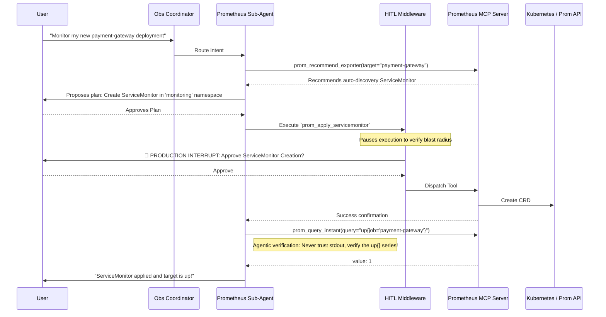

# Prometheus Sub-Agent (Observability Deep Agent)

> [!NOTE]
> This agent specializes in **state-modifying operations** and deep metric analysis for the Prometheus ecosystem. Alert routing and silence management are handled by the [Alertmanager Sub-Agent](../alertmanager/README.md).

The **Prometheus Operator** is a specialized sub-agent that connects to the `prometheus-mcp-server`. It empowers `k8s-autopilot` to autonomously explore metric topologies, onboard applications to Prometheus, deploy synthetic probes, manage alerting rules, and optimize TSDB cardinality.

---

## 🏗️ Architecture & Interaction Flow

---

## 🛠️ Tool Capabilities Reference

The Prometheus sub-agent has access to a wide array of tools via the MCP server, segmented into Read-Only (Discovery) and State-Modifying (Implementation).

### Read-Only Discovery & Query Tools (Fast-Path)
*Used for exploration and verification. Do not trigger HITL interrupts.*

| Tool Name | Capability | Typical Usage |
|-----------|------------|---------------|
| `prom_query_instant` | Point-in-time PromQL | Checking current values, e.g., `up{}` state. |
| `prom_query_range` | Time-series PromQL | Rendering metric trends over time. |
| `prom_query_a2ui_chart` | Dynamic UI Rendering | Buffering large metric arrays into A2UI interactive charts. |
| `prom_validate_promql` | Syntax Verification | Checking complex PromQL before upserting into an alerting rule. |
| `prom_check_rule_group` | Rule Pre-flight | Validating an entire rule group YAML/JSON against the Prom API. |
| `prom_optimize_cardinality` | TSDB FinOps | Identifying high-cardinality labels inflating storage costs. |
| `prom_test_endpoint` | Connectivity Diagnostic | Reaching out to an endpoint from the MCP server to verify it's scrapable. |

### State-Modifying Tools
*Gated by the `HumanInTheLoopMiddleware`. Execution is paused until explicit user approval.*

| Tool Name | Action | Required Parameters | Impact / Blast Radius |
|-----------|--------|---------------------|-----------------------|
| `prom_install_exporter` | Deploys exporter workloads (DaemonSet/Deployment + Service). | `exporter_type`, `namespace` | Creates active workloads on the cluster. |
| `prom_uninstall_exporter` | Tears down exporter workloads. | `exporter_type`, `namespace` | Target drops from Prometheus; historical data preserved. |
| `prom_apply_servicemonitor` | Creates Prometheus Operator ServiceMonitor CRDs. | `service_name`, `namespace` | Wires a service to Prometheus scrape loops. |
| `prom_upsert_rule_group` | Pushes recording/alerting rules (API or K8s CRD mode). | `group_name`, `rules`, `storage_mode` | Triggers alerts; evaluates continuously. |
| `prom_manage_file_sd` | Modifies file-based service discovery JSON. | `file_sd_path`, `targets`, `sub_action` | Triggers a Prometheus config reload. |
| `prom_apply_probe` | Sets up synthetic blackbox monitoring. | `module`, `targets` | Configures external probing via blackbox_exporter. |

---

## 🔒 Safety Principles & Sub-Agent Constraints

The Prometheus sub-agent operates under strict safety guidelines codified in its `SKILL.md` file. The LLM is instructed to enforce these rules autonomously:

1. **Mandatory Dual-Layer HITL**: 
   - **Layer 1 (Planning)**: The agent MUST use `request_human_input` to present a formatted plan detailing what resources will be created.
   - **Layer 2 (Execution)**: The middleware physically prevents the execution of tools like `prom_upsert_rule_group` without explicit `InterruptOnConfig` approval.
2. **Verify After Write (Trust but Verify)**: The agent is forbidden from declaring success just because a tool returned `success: true`. It MUST run an active verification query (e.g., checking the `up{}` metric after installing an exporter, or querying `probe_success` after applying a probe).
3. **Validate Before Upsert**: Before pushing any alerting rule via `prom_upsert_rule_group`, the agent MUST run the rules through `prom_check_rule_group` to catch syntax or templating errors.
4. **Counter Enforcement**: When writing queries or rules against counter metrics, the agent MUST wrap them in `rate()` or `increase()`. Raw counters are disallowed unless explicitly requested via `allow_raw_counters=true`.
5. **CRD Discovery Before Patching**: If `storage_mode="k8s_crd"` is used, the agent cannot blindly push rules. It MUST first discover the exact CRD name and labels using `prom://kubernetes/prometheusrules`.

---

## 🖥️ A2UI Dynamic Visualization

When users request to chart metric data visually (e.g., "Plot the memory usage"), the agent uses the **A2UI Protocol**:

1. **Query**: The agent executes `prom_query_a2ui_chart(query="...", start="...", end="...")`.
2. **Buffer**: The massive JSON payload of time-series data matrices is intercepted by the `A2UIBufferMiddleware` to protect the LLM context.
3. **Render**: The agent reads the buffer pointer and calls `build_obs_a2ui`, generating a rich, interactive React line chart in the frontend.

---

## 🚀 Concrete Workflow Examples

### Example 1: Synthetic Endpoint Monitoring

When a user asks: *"Ping `https://api.example.com` every minute and alert me if it's down."*

1. **Discovery**: The agent checks if the `blackbox_exporter` is installed.
2. **Provision**: If missing, it proposes `prom_install_exporter(exporter_type="blackbox", namespace="monitoring")`.
3. **Configure Probe**: It proposes `prom_apply_probe(module="http_2xx", prober_url="blackbox-exporter:9115", targets=["https://api.example.com"])`.
4. **Validation**: It creates the draft alerting rule `probe_success == 0` and validates it with `prom_validate_promql`.
5. **Verify**: Post-approval, it checks `prom_query_instant(query="probe_success{instance='https://api.example.com'}")` to confirm the synthetic ping is working.

### Example 2: Target Troubleshooting (Missing Metrics)

When a user says: *"My checkout service isn't showing up in Prometheus."*

1. **Topology Check**: The agent queries `prom://topology/failed_targets`.
2. **Diagnosis**: It sees the target is `DOWN` with an `HTTP 401 Unauthorized` error.
3. **Direct Testing**: It uses `prom_test_endpoint` to attempt scraping the `/metrics` path directly from the cluster network to verify if it's a network issue or an auth issue.
4. **Resolution**: The agent explains the auth mismatch to the user and proposes a patch to the `ServiceMonitor` to include the correct bearer token.

---

> [!TIP]
> **Out-of-Scope Diagnostics:** If the agent exhausts its MCP diagnostic tools (e.g., target is down and endpoint test times out), it will NOT attempt to blindly grep log files. Instead, it will explicitly advise the user to run `kubectl logs` and `kubectl describe`, adhering strictly to its observability mandate.
