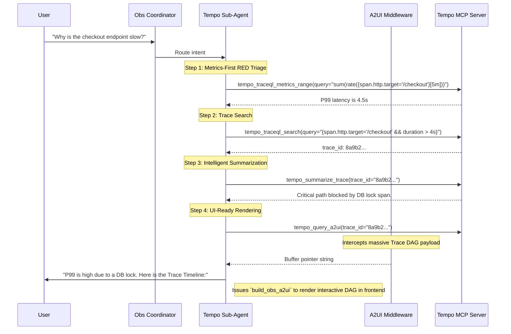

# Tempo Sub-Agent (Observability Deep Agent)

> [!NOTE]
> This agent handles distributed tracing, RED metrics derivation, and Trace-to-Log correlations. For pure metric querying, see the [Prometheus Sub-Agent](../prometheus/README.md).

The **Tempo Operator** connects to the `tempo-mcp-server`. It empowers `k8s-autopilot` to navigate massive tracing datasets via TraceQL, summarize critical paths, execute trace comparisons, derive RED metrics dynamically from spans, and manage Tempo Operator CRDs.

---

## 🏗️ Architecture & Interaction Flow

---

## 🛠️ Tool Capabilities Reference

The Tempo sub-agent is heavily focused on multi-step analytical workflows. It contains 21 read-only tools and 2 state-modifying CRD tools.

### Read-Only Discovery & Analysis Tools
*Do not trigger HITL interrupts.*

| Tool Name | Capability | Typical Usage |
|-----------|------------|---------------|
| `tempo_list_backends` | Discovery | Listing connected Tempo backends and versions. |
| `tempo_get_attribute_names` | Schema Discovery | Discovering valid TraceQL span/resource attributes. |
| `tempo_traceql_search` | Search | Searching for traces by tag, duration, or error state. |
| `tempo_summarize_trace` | Intelligent AI | Extracting critical paths, bottlenecks, and error root causes automatically from a trace. |
| `tempo_compare_traces` | A/B Diffing | Comparing a slow trace vs a fast trace to find the structural variance. |
| `tempo_traceql_metrics_range` | RED Metrics | Deriving latency P99s or error rates directly from trace spans without Prometheus. |
| `tempo_get_service_dependencies`| Topology | Generating a DAG of service-to-service calls. |
| `tempo_query_a2ui` | Dynamic UI | Buffering a DAG-pruned trace payload for frontend rendering. |

### Cross-Pillar Pivot Tools
*Used to bridge Tracing with Logging and Alerting.*

| Tool Name | Pivot Type | Action |
|-----------|------------|--------|
| `tempo_get_exemplar_traces` | Metrics → Traces | Extracts exact trace IDs attached to Prometheus metric exemplars. |
| `tempo_get_trace_from_log` | Logs → Traces | Extracts trace IDs from Loki log lines and pulls the full trace. |
| `tempo_generate_alerting_expression` | Traces → Alerts | Converts a TraceQL anomaly pattern into a Prometheus Alerting Rule YAML snippet. |

### State-Modifying Tools
*Gated by the `HumanInTheLoopMiddleware`. Tools **must** be executed with `dry_run=true` during planning.*

| Tool Name | Action | Required Parameters | Impact / Blast Radius |
|-----------|--------|---------------------|-----------------------|
| `tempo_create_operator_cr` | Creates TempoStack/TempoMonolithic. | `name`, `namespace`, `dry_run` | Deploys a new Tempo cluster backend. |
| `tempo_patch_operator_cr` | Mutates a Tempo CRD. | `name`, `namespace`, `patch`, `dry_run` | Modifies retention, resources, or storage. |

---

## 🔒 Safety Principles & Sub-Agent Constraints

The Tempo sub-agent must adhere to querying guardrails to protect backend performance:

1. **Query Policy Respect**: The agent must adhere to limits returned by `tempo_get_query_policies` (e.g., max search window, max SPSS limits).
2. **Metrics-Generator Awareness**: The agent knows that RED metrics tools (`tempo_traceql_metrics_range`) and topology mapping (`tempo_get_service_dependencies`) will ONLY work if the Tempo backend has the `local-blocks` metrics-generator enabled. It verifies this via `tempo_get_backend`.
3. **Mandatory CRD Dry-Runs**: For the two state-modifying tools, the agent MUST use `dry_run=true` first, present the YAML manifest to the user, and gain HITL approval before flipping to `dry_run=false`.
4. **Scope Awareness**: TraceQL requires strict attribute scoping. The agent knows `resource.service.name` is different from `span.http.method` and uses them correctly in queries.

---

## 🖥️ A2UI Dynamic Visualization

When users request to visualize a trace (e.g., "Show me the trace timeline for that error"), the agent uses the **A2UI Protocol**:

1. **Query**: The agent executes `tempo_query_a2ui(trace_id="8a9b2...")`.
2. **Buffer**: The massive JSON payload containing the DAG-pruned span tree is intercepted by the `A2UIBufferMiddleware` to protect the LLM context.
3. **Render**: The agent reads the buffer pointer and calls `build_obs_a2ui`, generating a rich, interactive React trace timeline and span-waterfall visualization in the frontend.

---

## 🚀 Concrete Workflow Examples

### Example 1: Missing Traces Diagnostic

When a user complains: *"Why can't I find traces for my new deployment?"*

1. **Backend Health**: The agent checks `tempo_list_backends` to ensure Tempo is up.
2. **Schema Check**: It queries `tempo_get_attribute_values(attribute="resource.service.name")`.
3. **Analysis**: If the new service name isn't listed, it knows the spans aren't reaching the backend.
4. **Escalation**: It advises the user that auto-instrumentation might be failing and suggests escalating to the OpenTelemetry sub-agent to check the collector pipeline.

### Example 2: Correlating Traces to Alerts

When a user asks: *"Create an alert whenever the billing service takes longer than 5 seconds."*

1. **Search**: The agent verifies the query structure with `tempo_traceql_search(query="{resource.service.name='billing' && duration > 5s}")`.
2. **Generate Rule**: It calls `tempo_generate_alerting_expression` to convert this TraceQL pattern into a Prometheus recording rule via the metrics-generator.
3. **Cross-MCP Handoff**: It takes the generated YAML snippet and escalates it to the Prometheus sub-agent, which then executes `prom_upsert_rule_group` to deploy the rule to the cluster.
